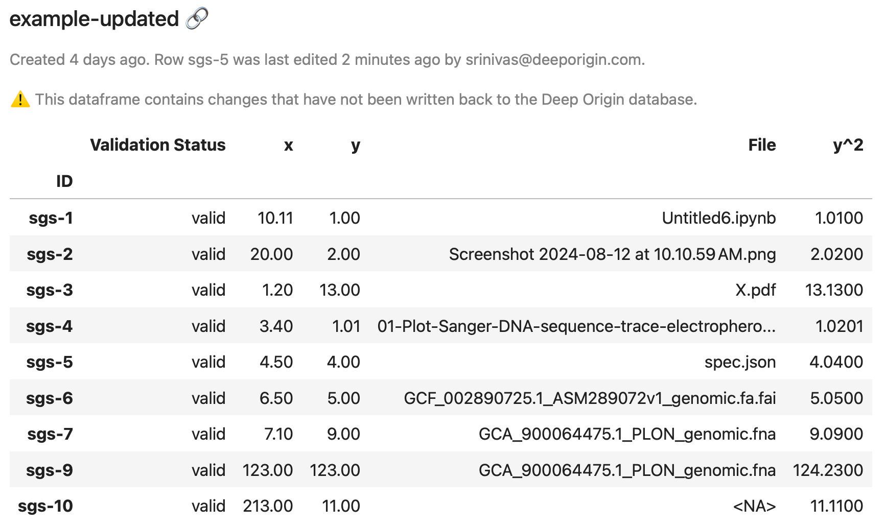
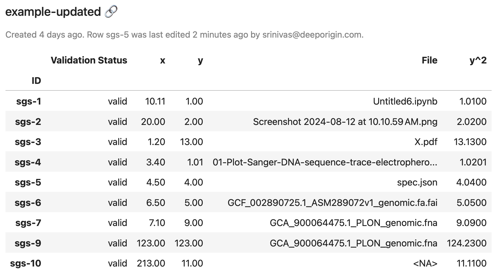
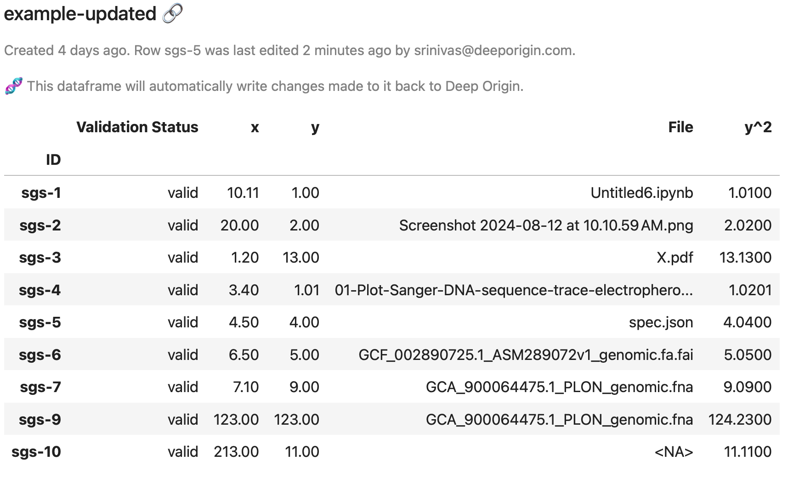

# Using Deep Origin DataFrames

This page describes how to use Deep Origin DataFrames, which are the primary object you will use to interact with databases on Deep Origin. This page will cover:

- fetching data from a Deep Origin database
- modifying data locally
- writing data back to Deep Origin


!!! question "What is a Deep Origin DataFrame?"
    A Deep Origin DataFrame is a subclass of a [pandas.DataFrame](https://pandas.pydata.org/docs/reference/api/pandas.DataFrame.html) that is created from a Deep Origin database, and can easily write data back to it. Because it is a subclass of a pandas DataFrame, all pandas DataFrame methods work on Deep Origin DataFrames. 

## Create a DataFrame

Create a DataFrame using:

```python
from deeporigin import DataFrame
df = DataFrame.from_deeporigin("database-id")
```

In an interactive web-based environment such as Jupyter Lab, you should be able to view the DataFrame using:

```py
df
```

which should show you something like this:


!!! tip "Information in the DataFrame"
    In addition to information you would find in the rows and columns of a pandas DataFrame, a Deep Origin DataFrame also contains metadata about the underling database. In the view above we also see:

    - The name of the database on Deep Origin.
    - A link to the database on Deep Origin.
    - When the database was created.
    - Information about the last edit made to the database. 


## Modify data in the DataFrame

Because a Deep Origin DataFrame is a subclass of a pandas DataFrame, all pandas DataFrame methods work on Deep Origin DataFrames. In this example, we modify values in one of the columns, or modify a single cell.


=== "Modify entire columns"

    To modify entire columns, use native pandas syntax:

    ```python
    df["y^2"] = df["y"] ** 2
    ```

=== "Modify data in a single cell"

    To modify data in a single cell, use native pandas syntax (the at operator):

    ```python
    df.at["sgs-1", "y"] = 10
    ```

In either case, when we view the DataFrame once more using `df`, we see the updated data, together with a warning telling us that we have local changes that haven't been written back to Deep Origin.




## Write data back to Deep Origin

### Using the `to_deeporigin` method

Local changes in the dataframe can be written back to Deep Origin using the `to_deeporigin` method:

```python
df.to_deeporigin()

# ✔︎ Wrote 9 rows in y^2 to Deep Origin database.
```

!!! tip "Intelligent writing"
    - Deep Origin DataFrames keep track of local changes, and only write columns back that have been modified locally. 
    - Every call of `to_deeporigin` will generate a print statement describing the changes that have been written back to Deep Origin. 
    - Because a Deep Origin DataFrame corresponds to a database on Deep Origin, there is no need to specify the database name in the `to_deeporigin` method.

If we now view the dataframe once more using `df`, we see the following:



Note that the warning about local changes that have not been written back to Deep Origin has disappeared, because the changes **have** been written back to Deep Origin.

### Automatic writing to Deep Origin

All Deep Origin DataFrames have an attribute called `auto_sync` that determines if local changes are written automatically to Deep Origin. By default, `auto_sync` is set to `False`, requiring you to call the `to_deeporigin` method to write changes back to Deep Origin.

To enable automatic syncing, set the `auto_sync` attribute to `True`:

```python
df.auto_sync = True
df
```



Note that the dataframe now displays a message indicating that local changes will be written back to Deep Origin.

Making any change to the dataframe now triggers a write back to the Deep Origin database.

```python
df["y^2"] = df["y"] * 0.99
df

# ✔︎ Wrote 9 rows in y^2 to Deep Origin database.
```

!!! danger "Use `auto_sync` with caution"
    Turning on `auto_sync` on dataframes can be dangerous. 
    - Changes made to the local database are written to a Deep Origin database automatically, and no confirmation is asked for. 
    - This can cause data loss.
    - Every change made to the database is written immediately, so modifying the local dataframe multiple times leads to multiple writes to a Deep Origin database.

## Limitations


- Creating new columns in the local dataframe will not create new columns in the Deep Origin database. To insert data into a new column, create a new column using the GUI or the API and then use the `from_deeporigin` method.
- Deleting columns in the local dataframe will not delete columns in the Deep Origin database. To delete a column, use the GUI or the API and then use the `from_deeporigin` method.
- Deleting or creating rows is not supported yet. 

## Reference

Read more about the `to_deeporigin` method [here](../ref/data-hub/types.md#src.data_hub.dataframe.DataFrame.sync). 