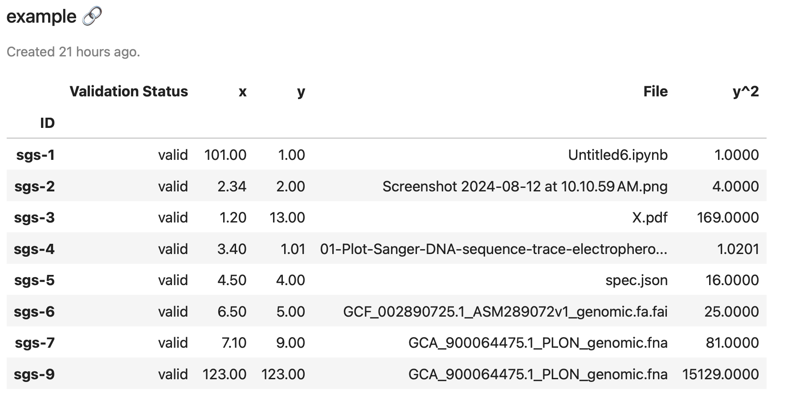

# Using Deep Origin DataFrames

This page describes how to use Deep Origin DataFrames, which are the primary object you will use to interact with databases on Deep Origin. This page will cover:

- fetching data from a Deep Origin database
- modifying data locally
- writing data back to Deep Origin


!!! question "What is a Deep Origin DataFrame?"
    A Deep Origin DataFrame is a subclass of a [pandas.DataFrame](https://pandas.pydata.org/docs/reference/api/pandas.DataFrame.html) that is backed by a Deep Origin database. Because it is a subclass of a pandas DataFrame, all pandas DataFrame methods work on Deep Origin DataFrames. 

## Create a DataFrame

Create a DataFrame using:

```python
from deeporigin.data_hub import api
df = api.get_data_frame("database-id")
```

In an interactive web-based environment such as Jupyter Lab, you should be able to view the DataFrame using:

```py
df
```

which should show you something like this:




!!! tip "Information in the DataFrame"
    In addition to information you would find in the rows and columns of a pandas DataFrame, a Deep Origin DataFrame also contains metadata about the underling database. In the view above we also see:

    - The name of the database on Deep Origin.
    - A link to the database on Deep Origin
    - When the database was created.

## Modify data in the DataFrame

Because a Deep Origin DataFrame is a subclass of a pandas DataFrame, all pandas DataFrame methods work on Deep Origin DataFrames. In this example, we modify values in one of the columns, or modify a single cell.


### Modify entire columns

To modify entire columns, use native pandas syntax:

```python
df["y^2"] = df["y"] ** 2
```

### Modify data in a single cell

To modify data in a single cell, use native pandas syntax (the at operator):

```python
df.at["sgs-1", "y"] = 10
```


## Write data back to Deep Origin

!!! success "Nothing to do here!"
    A Deep Origin DataFrame automatically syncs back to the Deep origin database. Making the changes above also makes changes in the source database. 


### Manually syncing

Automatic syncing occurs when the `auto_sync` attribute of a Deep Origin DataFrame is set to `True`. You may want to turn `auto_sync` off if you want to manually sync back to the source database, for example if you want to keep the changes in the source database.

To manually sync changes, use the `sync` method:

```python
df.sync()
```

Read more about the sync method [here](../ref/data-hub/types.html#src.data_hub.dataframe.DataFrame.sync). 