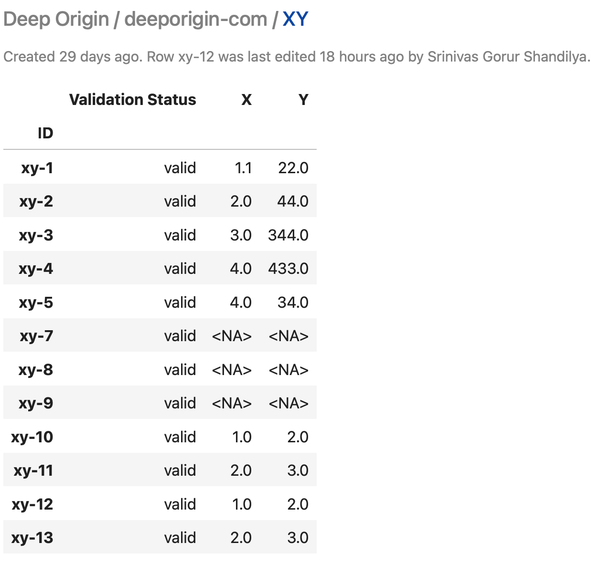

# Add data to a Deep Origin Database

This document describes how to add data to a Deep Origin Database.

Consider the following dataframe constructed from a database using:

```python notest
from deeporigin.data_hub import api
df = api.get_dataframe("xy")
df
```



## Add new rows

To add new rows to the underlying database, use the `add_databse_rows` function:

```python notest
data = dict(X=[1, 2], Y=[2, 3])
api.add_database_rows(database_id="xy", data=data)
```

`data` should be a dictionary where the keys are column names and the values are lists of values to be written to the corresponding columns. `add_database_rows` will add this data to the database, creating as many new rows as needed. 

`add_database_rows` returns a list of the row IDs created during this process.


## Add fragments of new rows 

Similarly, fragments of rows (subsets of columns) can be written to the database:

```python notest
data = dict(X=[10, 20]) # note Y is not specified
api.add_database_rows(database_id="xy", data=data)
```

`add_database_rows` returns a list of the row IDs created during this process, for example:

```python notest
["row-1", "row-2"]
```


## Reference

The reference documentation for [add_database_rows](../ref/high-level-api.md#src.data_hub.api.add_database_rows)