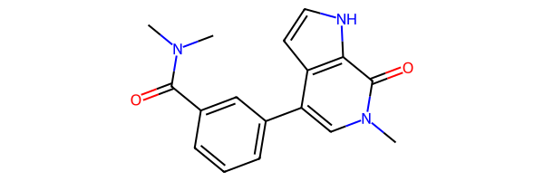

This document describes how to work with ligands (molecules) and use them in Deep Origin tools. 

## The `Ligand` class

The [`Ligand` class](../ref/chemistry.md#src.chemistry.Ligand) is the primary way to work with ligands in Deep Origin.

## Constructing a ligand

### From a file

A ligand can be constructed from a file:

```python
from deeporigin.chemistry import Ligand
from deeporigin import drug_discovery as dd

ligand = Ligand(dd.EXAMPLE_DATA_DIR / "brd-2.sdf")
```

### From a [SMILES :octicons-link-external-16:](https://en.wikipedia.org/wiki/Simplified_Molecular_Input_Line_Entry_System) string

A ligand can also be constructed from a SMILES string:


```python
from deeporigin.chemistry import Ligand
ligand = Ligand(smiles_string="[H]C1=C([H])C(C(=O)N(C([H])([H])[H])C([H])([H])[H])=C([H])C(C2=C([H])N(C([H])([H])[H])C(=O)C3=C2C([H])=C([H])N3[H])=C1[H]")
```

### From a CSV file

You can create multiple ligands at once from a CSV file using the `from_csv` class method. This is useful when you have a dataset of molecules with their SMILES strings and associated properties. The `from_csv` method:

- Requires a path to the CSV file and the name of the column containing SMILES strings
- Optionally accepts a list of column names to extract as properties
- Skips rows with empty or invalid SMILES
- Returns a list of `Ligand` objects

This approach is ideal for processing large datasets of molecules where each row represents a different compound.

#### Basic Usage

For the simplest case, just specify the file path and which column contains the SMILES strings:

```python
from deeporigin.chemistry import Ligand

# Basic usage - just extracting SMILES from a column
ligands = Ligand.from_csv(
    file="molecules.csv",
    smiles_column="SMILES"
)
```

#### Including Properties

You can also extract additional properties from other columns in the CSV file:

```python
ligands = Ligand.from_csv(
    file="molecules.csv",
    smiles_column="SMILES",
    properties_columns=["Name", "MW", "LogP", "Activity"]
)
```

This will store all the specified column values as properties for each ligand, making it easy to keep track of important molecular characteristics alongside the structure information.


## Visualizing a ligand

??? warning "Browser support"
    These visualizations work best on Google Chrome. We are aware of issues on other browsers, especially Safari on macOS.

A ligand object can be visualized using `show`:

```python
ligand.show()
```

If a ligand is backed by a SDF file, a 3D visualization will be shown, similar to:

A visualization such as this will be shown:

<iframe 
    src="./ligand.html" 
    width="100%" 
    height="600" 
    style="border:none;"
    title="ligand visualization"
></iframe>

!!! info "Jupyter notebook required"
    Visualizations such as these require this code to be run in a jupyter notebook. We recommend using [these instructions](../../install.md) to install Jupyter.


If a ligand is not backed by a SDF file, a 2D visualization will be shown:

