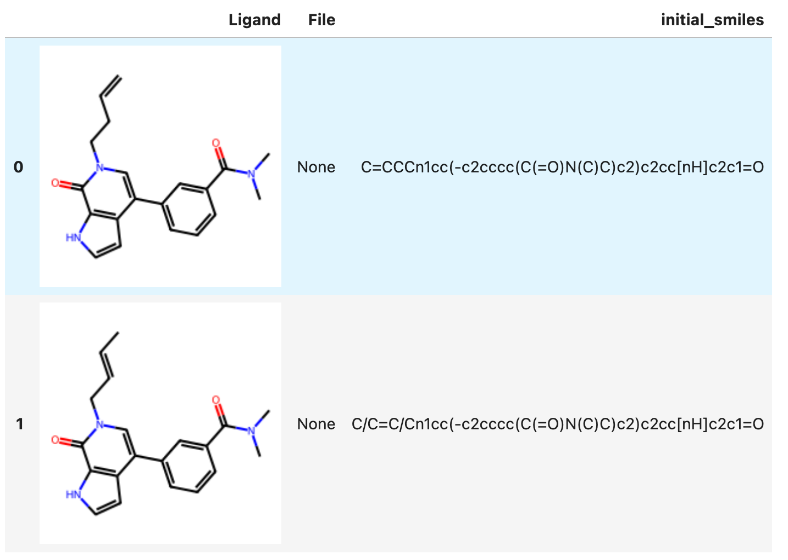
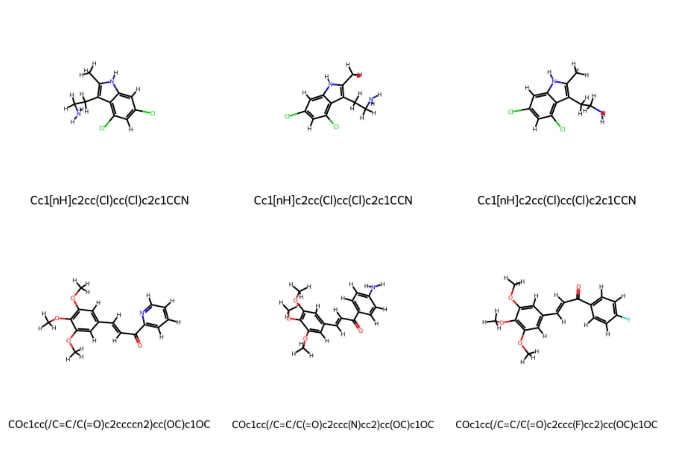
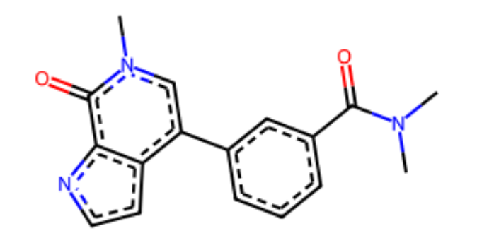

This document describes how to work with ligands (molecules) and use them in Deep Origin tools. 

There are two classes that help you work with ligands:

- [`Ligand` class](../ref/ligand.md)
- [`LigandSet` class](../ref/ligandset.md)


## Constructing a Ligand or LigandSet

### From a SDF file

=== "Single Ligand"

    A single `Ligand` can be constructed from a SDF file:

    ```python
    from deeporigin.drug_discovery import Ligand, BRD_DATA_DIR

    ligand = Ligand.from_sdf(BRD_DATA_DIR / "brd-2.sdf")
    ```

=== "Many Ligands"

    A `LigandSet` can be constructed from a SDF File:

    ```python
    from deeporigin.drug_discovery import LigandSet, DATA_DIR

    ligands = LigandSet.from_sdf(DATA_DIR / "ligands" / "ligands-brd-all.sdf")
    ```

### From SMILES string(s)

=== "Single Ligands"

    A ligand can be constructed from a SMILES string, which is a compact way to represent molecular structures:

    ```python
    from deeporigin.drug_discovery import Ligand

    ligand = Ligand.from_smiles(
        smiles="c1ccccc1", 
        name="Oxo",     # Optional name for the ligand
    )
    ```

    !!! note "SMILES Validation"
        The constructor will raise an exception if the provided SMILES string is invalid or cannot be parsed into a valid molecule.

=== "Many ligands"

    A `LigandSet` can be constructed from a list or set of SMILES strings:

    ```python
    from deeporigin.drug_discovery import LigandSet

    smiles = {
        "C/C=C/Cn1cc(-c2cccc(C(=O)N(C)C)c2)c2cc[nH]c2c1=O",
        "C=CCCn1cc(-c2cccc(C(=O)N(C)C)c2)c2cc[nH]c2c1=O",
    }

    ligands = LigandSet.from_smiles(smiles)
    ```


### From a Chemical Identifier

You can create a ligand from common chemical identifiers (like PubChem names, common names, or drug names). This is particularly useful when working with well-known biochemical molecules:

```python
from deeporigin.drug_discovery import Ligand

# Create ligands from common biochemical names
atp = Ligand.from_identifier(
    identifier="ATP",  
)

serotonin = Ligand.from_identifier(
    identifier="serotonin", 
)
```

The `from_identifier` constructor:

- Accepts common chemical names and identifiers
- Automatically resolves the identifier to a molecular structure
- Creates a 3D conformation of the molecule
- Particularly useful for well-known biochemical molecules like:
    - Nucleotides (ATP, ADP, GTP, etc.)
    - Neurotransmitters (serotonin, dopamine, etc.)
    - Drug molecules (by their generic names)
    - Common metabolites and cofactors

!!! note "Identifier Resolution"
    The constructor will attempt to resolve the identifier using chemical databases. If the identifier cannot be resolved, it will raise an exception.

### From an RDKit Mol object

If you're working with RDKit molecules directly, you can create a `Ligand` from an RDKit Mol object:

```python
from deeporigin.drug_discovery import Ligand
from rdkit import Chem

# Create an RDKit molecule
mol = Chem.MolFromSmiles("CCO")  # Ethanol

# Convert to a Ligand
ligand = Ligand.from_rdkit_mol(
    mol=mol,
    name="Ethanol",  # Optional name for the ligand
)
```

This is particularly useful when you're working with RDKit's molecular manipulation functions and want to convert the results into a Deep Origin Ligand object for further processing or visualization.


The method will:

- Read the CSV file using pandas
- Extract SMILES strings from the specified column
- Create a Ligand instance for each valid SMILES
- Store all other columns as properties in each Ligand instance
- Skip any rows with empty or invalid SMILES strings

!!! note "Error Handling"
    The method will raise:
    - `FileNotFoundError` if the CSV file does not exist
    - `ValueError` if the specified SMILES column is not found in the CSV file

### From a CSV file

You can also create a `LigandSet` from a CSV file containing SMILES strings and optional properties:

```python
from deeporigin.drug_discovery import LigandSet, DATA_DIR

ligands = LigandSet.from_csv(
    file_path=DATA_DIR / "ligands" / "ligands.csv",
    smiles_column="SMILES"  # Optional, defaults to "smiles"
)
```

## Visualization

!!! info "Jupyter notebook required"
    Visualizations such as these require this code to be run in a jupyter notebook. We recommend using [these instructions](../../install.md) to install Jupyter.

??? warning "Browser support"
    These visualizations work best on Google Chrome. We are aware of issues on other browsers, especially Safari on macOS.


### Ligands


A ligand object can be visualized using `show`:

```python
from deeporigin.drug_discovery import Ligand

ligand = Ligand.from_identifier("serotonin")

ligand.show()
```

A visualization similar to the following will be shown:

<iframe 
    src="./serotonin.html" 
    width="100%" 
    height="600" 
    style="border:none;"
    title="Visualization of single ligand (serotonin)"
></iframe>

### LigandSets

A `LigandSet` can be visualized using several different methods. 

#### Table view (2D)

First, simply printing the `LigandSet` shows a table of ligands in the `LigandSet`:

```python
from deeporigin.drug_discovery import LigandSet

smiles = {
    "C/C=C/Cn1cc(-c2cccc(C(=O)N(C)C)c2)c2cc[nH]c2c1=O",
    "C=CCCn1cc(-c2cccc(C(=O)N(C)C)c2)c2cc[nH]c2c1=O",
}

ligands = LigandSet.from_smiles(smiles)
ligands

```

!!! success "Expected Output"

    


This table view is also available using `ligands.show_df`

#### Individual view (3D)

To view 3D structures of all ligands in a LigandSet, use:


```python

from deeporigin.drug_discovery import LigandSet, DATA_DIR

ligands = LigandSet.from_sdf(DATA_DIR / "ligands" / "ligands-brd-all.sdf")
ligands.show()

```

A visualization similar to this will be shown. Use the arrows to flip between ligands in the `LigandSet`. 

<iframe 
    src="./brd-3d.html" 
    width="100%" 
    height="600" 
    style="border:none;"
    title="Visualization of ligands"
></iframe>

#### Grid view (2D)

To view a grid of all 2D structures of all ligands in the `LigandSet`, use:

```{.python notest}
ligands.show_grid()

```

!!! success "Expected Output"

    


## Operations on Ligands

### Ligand Minimization 

You can minimize the 3D structure of a single ligand or all ligands in a LigandSet. Minimization optimizes the geometry of the molecule(s) using a force field, which is useful for preparing ligands for docking or other modeling tasks.

=== "Ligand"

    ```python
    from deeporigin.drug_discovery import Ligand, BRD_DATA_DIR

    ligand = Ligand.from_sdf(BRD_DATA_DIR / "brd-2.sdf")
    ligand.minimize()  # Optimizes the 3D coordinates in place
    ```

=== "LigandSet"

    ```python
    from deeporigin.drug_discovery import LigandSet, DATA_DIR

    ligands = LigandSet.from_sdf(DATA_DIR / "ligands" / "ligands-brd-all.sdf")
    ligands.minimize()  # Optimizes all ligands in the set in place
    ```

    This will call the `minimize()` method on each ligand in the set, updating their 3D coordinates. The method returns the LigandSet itself for convenience, so you can chain further operations if desired.

### Constructing a network using Konnektor

To run RBFE, it is helpful to map out a network within the ligand set, so that we can run RBFE on those pairs of ligands. To do so, use:

```{.python notest}
# assuming ligands is a LigandSet
ligands.map_network().show_network()
```

maps the network and creates a visualization similar to:

<iframe 
    src="./network.html" 
    width="100%" 
    height="600" 
    style="border:none;"
    title="Visualization of network"
></iframe>

### Predicting ADMET Properties

ADMET (Absorption, Distribution, Metabolism, Excretion, and Toxicity) properties can be predicted for Ligands or LigandSets.

=== "Ligands"

    You can predict ADMET properties for a ligand using the `admet_properties` method:

    ```{.python notest}
    # Predict ADMET properties
    properties = ligand.admet_properties()
    ```

    The method returns a dictionary containing various ADMET-related predictions:

    ```python
    {
        'smiles': 'Cn1c(=O)n(Cc2ccccc2)c(=O)c2c1nc(SCCO)n2Cc1ccccc1',
        'properties': {
            'logS': -4.004,  # Aqueous solubility
            'logP': 3.686,   # Partition coefficient
            'logD': 2.528,   # Distribution coefficient
            'hERG': {'probability': 0.264},  # hERG inhibition risk
            'ames': {'probability': 0.213}, # Ames mutagenicity
            'cyp': {     # Cytochrome P450 inhibition
                'probabilities': {
                    'cyp1a2': 0.134,
                    'cyp2c9': 0.744,
                    'cyp2c19': 0.853,
                    'cyp2d6': 0.0252,
                    'cyp3a4': 0.4718
                }
            },
            'pains': {    # PAINS (Pan Assay Interference Compounds)
                'has_pains': None,
                'pains_fragments': []
            }
        }
    }
    ```

    The predicted properties are automatically stored in the ligand's properties dictionary and can be accessed later using the `get_property` method:

    ```{.python notest}
    # Access a specific property
    logP = ligand.get_property('logP')
    ```

    !!! note "Property Storage"
        All predicted properties are automatically stored in the ligand's properties dictionary and can be accessed at any time using the `get_property` method.

=== "LigandSets"

    You can predict ADMET properties for all ligands in a `LigandSet` using the `admet_properties` method. This will call the prediction for each ligand and display a progress bar using `tqdm`:

    ```{.python notest}
    from deeporigin.drug_discovery import LigandSet, DATA_DIR

    ligands = LigandSet.from_csv(
        file_path=DATA_DIR / "ligands" / "ligands.csv",
        smiles_column="SMILES"
    )

    ligands.admet_properties()  
    ```

    Each entry in `results` is a dictionary of ADMET properties for the corresponding ligand. The properties are also stored in each ligand's `.properties` attribute for later access.

    To view ADMET properties of all ligands in the ligand set, simply view the ligandset as a dataframe using:

    ```{.python notest}
    ligands
    ```

    or, optionally, convert to a DataFrame for further analysis:

    ```{.python notest}
    ligands.to_dataframe()
    ```

### Random Sampling

You can randomly sample ligands from a `LigandSet` using the `random_sample` method:

```python
from deeporigin.drug_discovery import LigandSet, DATA_DIR

ligands = LigandSet.from_sdf(DATA_DIR / "ligands" / "ligands-brd-all.sdf")

# Sample 3 random ligands
sample = ligands.random_sample(3)
print(f"Sampled {len(sample)} ligands from {len(ligands)} total ligands")
```

The `random_sample` method:
- Returns a new `LigandSet` containing the randomly selected ligands
- Uses unbiased random sampling without replacement
- Preserves the original `LigandSet` (doesn't modify it)
- Raises a `ValueError` if you try to sample more ligands than available

This is useful for:
- Creating smaller subsets for testing or development
- Statistical analysis and validation
- Reducing computational load while maintaining diversity

### Maximum Common Substructure

The Maximum Common Substructure (MCS) for a `LigandSet` can be computed as follows:

```python
from deeporigin.drug_discovery import BRD_DATA_DIR, LigandSet

ligands = LigandSet.from_dir(BRD_DATA_DIR)
ligands.mcs()
```

!!! success "Expected Output"
    


### Constraints

Ligands in a LigandSet can be aligned to a reference ligand using:

```python
from deeporigin.drug_discovery import BRD_DATA_DIR, LigandSet

ligands = LigandSet.from_dir(BRD_DATA_DIR)
ligands.compute_constraints(reference=ligands[1])
```

## Exporting ligands

### To SDF files


=== "Ligands"

    To write a `Ligand` to a SDF file, use:

    ```python
    from deeporigin.drug_discovery import Ligand

    ligand = Ligand.from_smiles("NCCc1c[nH]c2ccc(O)cc12")
    ligand.to_sdf()
    ```
=== "LigandSet"

    To write a `LigandSet` to a SDF file, use:

    ```python
    from deeporigin.drug_discovery import LigandSet

    smiles = {
    "C/C=C/Cn1cc(-c2cccc(C(=O)N(C)C)c2)c2cc[nH]c2c1=O",
    "C=CCCn1cc(-c2cccc(C(=O)N(C)C)c2)c2cc[nH]c2c1=O",
    }

    ligands = LigandSet.from_smiles(smiles)
    ligands.to_sdf()
    ```


### To mol files

To write a ligand to a mol file, use:

```python
from deeporigin.drug_discovery import Ligand

ligand = Ligand.from_smiles("NCCc1c[nH]c2ccc(O)cc12")
ligand.to_mol()
```

### To PDB files

To write a ligand to a PDB file, use:

```python
from deeporigin.drug_discovery import Ligand

ligand = Ligand.from_smiles("NCCc1c[nH]c2ccc(O)cc12")
ligand.to_pdb()
```


### To Pandas DataFrames

To convert a LigandSet to a Pandas DataFrame, use:

```python
from deeporigin.drug_discovery import LigandSet, DATA_DIR

ligands = LigandSet.from_csv(
    file_path = DATA_DIR / "ligands" / "ligands.csv",
    smiles_column="SMILES"  # Optional, defaults to "smiles"
)
df = ligands.to_dataframe()
```

### To CSV files

To write a LigandSet to a CSV file, use method chaining:

```{.python notest}
# we're using pandas' native to_csv method here

ligands.to_dataframe().to_csv("temp.csv")

```