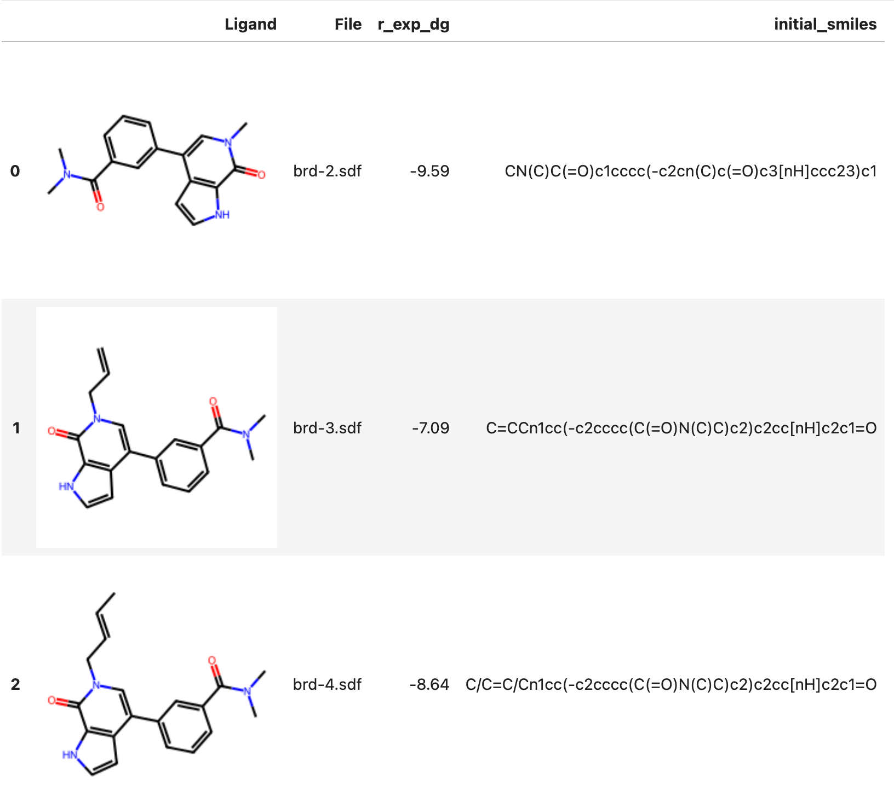
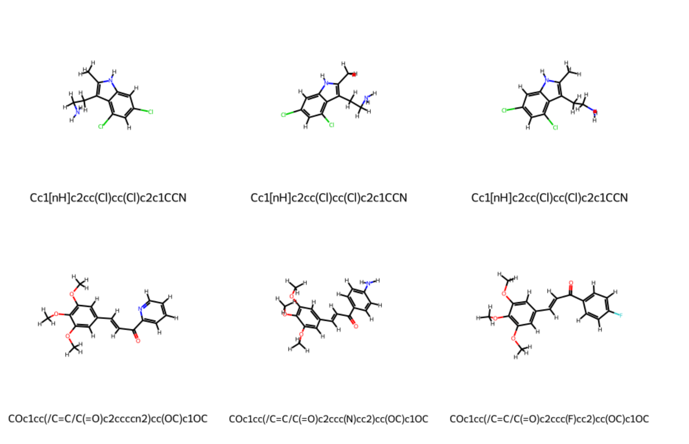
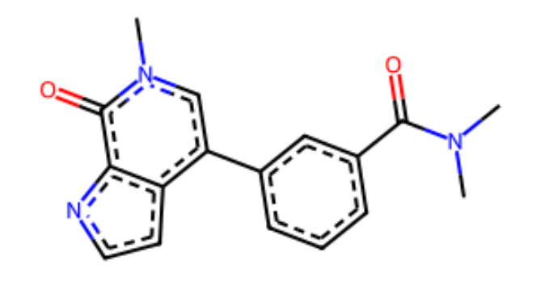

This document describes how to work with ligands (molecules) and use them in Deep Origin tools. 

There are two classes that help you work with ligands:

- [`Ligand` class](../ref/ligand.md)
- [`LigandSet` class](../ref/ligandset.md)


## Constructing a Ligand or LigandSet

### From a SDF file

=== "Single Ligand"

    A single `Ligand` can be constructed from a SDF file:

    ```python
    from deeporigin.drug_discovery import Ligand, BRD_DATA_DIR

    ligand = Ligand.from_sdf(BRD_DATA_DIR / "brd-2.sdf")
    ```

    To load a single-molecule SDF from org file storage, download and parse in one step with
    [`Ligand.from_remote_file`](../ref/ligand.md):

    ```python
    from deeporigin.drug_discovery import Ligand
    from deeporigin.platform.client import DeepOriginClient

    client = DeepOriginClient()
    ligand = Ligand.from_remote_file("path/in/bucket/ligand.sdf", client=client)
    ```

=== "Many Ligands"

    A `LigandSet` can be constructed from a SDF File:

    ```python
    from deeporigin.drug_discovery import LigandSet, DATA_DIR

    ligands = LigandSet.from_sdf(DATA_DIR / "ligands" / "ligands-brd-all.sdf")
    ```

=== "Multiple SDF Files"

    A `LigandSet` can be constructed from multiple SDF files by concatenating them together:

    ```python
    from deeporigin.drug_discovery import LigandSet, DATA_DIR

    # List of SDF file paths
    sdf_files = [
        DATA_DIR / "ligands" / "ligands-brd-all.sdf",
        DATA_DIR / "ligands" / "42-ligands.sdf"
    ]

    # Create LigandSet from multiple files
    ligands = LigandSet.from_sdf_files(sdf_files)
    
    # The resulting LigandSet contains all ligands from both files
    print(f"Total ligands: {len(ligands)}")  # Should be 8 + 42 = 50
    ```

    This is particularly useful when you have:
    - Multiple SDF files from different experiments
    - Split datasets that you want to combine
    - Files from different sources that need to be merged

### From SMILES string(s)

=== "Single Ligands"

    A ligand can be constructed from a SMILES string, which is a compact way to represent molecular structures:

    ```python
    from deeporigin.drug_discovery import Ligand

    ligand = Ligand.from_smiles(
        smiles="c1ccccc1", 
        name="Oxo",     # Optional name for the ligand
    )
    ```

    !!! note "SMILES Validation"
        The constructor will raise an exception if the provided SMILES string is invalid or cannot be parsed into a valid molecule.

=== "Many ligands"

    A `LigandSet` can be constructed from a list or set of SMILES strings:

    ```python
    from deeporigin.drug_discovery import LigandSet

    smiles = {
        "C/C=C/Cn1cc(-c2cccc(C(=O)N(C)C)c2)c2cc[nH]c2c1=O",
        "C=CCCn1cc(-c2cccc(C(=O)N(C)C)c2)c2cc[nH]c2c1=O",
    }

    ligands = LigandSet.from_smiles(smiles)
    ```


### From a Chemical Identifier

You can create a ligand from common chemical identifiers (like PubChem names, common names, or drug names). This is particularly useful when working with well-known biochemical molecules:

```{.python notest}
from deeporigin.drug_discovery import Ligand

# Create ligands from common biochemical names
atp = Ligand.from_identifier(
    identifier="ATP",  
)

serotonin = Ligand.from_identifier(
    identifier="serotonin", 
)
```

The `from_identifier` constructor:

- Accepts common chemical names and identifiers
- Automatically resolves the identifier to a molecular structure
- Creates a 3D conformation of the molecule
- Particularly useful for well-known biochemical molecules like:
    - Nucleotides (ATP, ADP, GTP, etc.)
    - Neurotransmitters (serotonin, dopamine, etc.)
    - Drug molecules (by their generic names)
    - Common metabolites and cofactors

!!! note "Identifier Resolution"
    The constructor will attempt to resolve the identifier using chemical databases. If the identifier cannot be resolved, it will raise an exception.

### From an RDKit Mol object

If you're working with RDKit molecules directly, you can create a `Ligand` from an RDKit Mol object:

```python
from deeporigin.drug_discovery import Ligand
from rdkit import Chem

# Create an RDKit molecule
mol = Chem.MolFromSmiles("CCO")  # Ethanol

# Convert to a Ligand
ligand = Ligand.from_rdkit_mol(
    mol=mol,
    name="Ethanol",  # Optional name for the ligand
)
```

This is particularly useful when you're working with RDKit's molecular manipulation functions and want to convert the results into a `Ligand` for further processing or visualization.

You can also create a `LigandSet` from a list of RDKit molecules:

```python
from deeporigin.drug_discovery import LigandSet
from rdkit import Chem

mols = [Chem.MolFromSmiles("CCO"), Chem.MolFromSmiles("CCCO")]
ligands = LigandSet.from_rdkit_mols(mols)
```


### From a CSV file

You can also create a `LigandSet` from a CSV file containing SMILES strings and optional properties:

```python
from deeporigin.drug_discovery import LigandSet, DATA_DIR

ligands = LigandSet.from_csv(
    file_path=DATA_DIR / "ligands" / "ligands.csv",
    smiles_column="SMILES"  # Optional, defaults to "smiles"
)
```


The method will:

- Read the CSV file using pandas
- Extract SMILES strings from the specified column
- Create a Ligand instance for each valid SMILES
- Store all other columns as properties in each Ligand instance
- Skip any rows with empty or invalid SMILES strings

!!! note "Error Handling"
    The method will raise:
    - `FileNotFoundError` if the CSV file does not exist
    - `DeepOriginException` if the specified SMILES column is not found in the CSV file

### From a directory

You can create a `LigandSet` from a directory containing SDF and CSV files:

```python
from deeporigin.drug_discovery import LigandSet, BRD_DATA_DIR

ligands = LigandSet.from_dir(BRD_DATA_DIR)
```

This will read all `.sdf` and `.csv` files in the directory and combine them into a single LigandSet.

### Filtering Top Poses

!!! warning "Deprecated: `docking_step` / `Complex.docking`"
    The `docking_step` module was removed; `Complex.docking` no longer exists. Prefer [`Docking`](../ref/docking.md) for docking outputs.

When working with docking results, you often have multiple poses for the same molecule. The `filter_top_poses()` method helps you select only the best pose for each unique molecule:

```{.python notest}

# assuming poses comes from Docking.get_poses() / Docking.run()

# Filter to keep only the best pose per molecule (by binding energy)
best_poses = poses.filter_top_poses()

# Or filter by pose score instead
best_poses = poses.filter_top_poses(by_pose_score=True)

```

!!! note "Creates New Object"
    The `filter_top_poses()` method creates a new `PoseSet` containing only the best pose for each unique molecule. The original set is not modified. By default, it selects poses by minimum binding energy, but you can use `by_pose_score=True` to select by maximum pose score instead.


## Visualization

!!! info "Jupyter notebook required"
    Visualizations such as these require this code to be run in a jupyter notebook. We recommend using [these instructions](../../install.md) to install Jupyter.

??? warning "Browser support"
    These visualizations work best on Google Chrome. We are aware of issues on other browsers, especially Safari on macOS.


### Ligands


A ligand object can be visualized using `show`:

```{.python notest}
from deeporigin.drug_discovery import Ligand

ligand = Ligand.from_identifier("serotonin")

ligand.show()
```

A visualization similar to the following will be shown:

<iframe 
    src="../../images/serotonin.html" 
    width="100%" 
    height="600" 
    style="border:none;"
    title="Visualization of single ligand (serotonin)"
></iframe>

### LigandSets

A `LigandSet` can be visualized using several different methods. 

#### Summary card

Simply inspecting the `LigandSet` object shows the following:

```{.python notest}
ligands
```


<div style='width: 500px; padding: 15px; border: 1px solid #ddd; border-radius: 6px; background-color: #f9f9f9;'><h3 style='margin-top: 0; color: #333;'>LigandSet with 8 ligands</h3><p style='margin: 8px 0;'><strong>8</strong> unique SMILES</p><p style='margin: 8px 0;'>Properties: initial_smiles, r_exp_dg</p><div style='margin-top: 12px; padding-top: 12px; border-top: 1px solid #ddd;'><p style='margin: 4px 0; font-size: 0.9em; color: #666;'><em>Use <code>.to_dataframe()</code> to convert to a dataframe, <code>.show_df()</code> to view dataframewith structures, or <code>.show()</code> for 3D visualization</em></p></div></div>

#### Table view (2D)

To view a dataframe containined rendered (2D) structures of ligands, use:

```python
# for example
from deeporigin.drug_discovery import LigandSet, DATA_DIR

ligands = LigandSet.from_sdf(DATA_DIR / "ligands" / "ligands-brd-all.sdf")
ligands.show_df()
```

!!! success "Expected Output"

    


#### Individual view (3D)

To view 3D structures of all ligands in a LigandSet, use:


```python

from deeporigin.drug_discovery import LigandSet, DATA_DIR

ligands = LigandSet.from_sdf(DATA_DIR / "ligands" / "ligands-brd-all.sdf")
ligands.show()

```

A visualization similar to this will be shown. Use the arrows to switch between Ligands in the `LigandSet`. 

<iframe 
    src="../../images/brd-ligands.html" 
    width="100%" 
    height="610" 
    style="border:none;"
    title="Visualization of ligands"
></iframe>

#### Grid view (2D)

To view a grid of all 2D structures of all ligands in the `LigandSet`, use:

```python
from deeporigin.drug_discovery import LigandSet, DATA_DIR

ligands = LigandSet.from_sdf(DATA_DIR / "ligands" / "ligands-brd-all.sdf")

ligands.show_grid()

```

!!! success "Expected Output"

    


## Operations on Ligands

### Preparing Ligands

You can prepare a ligand for downstream workflows using the `prepare()` method. This selects an organic parent when the input is an unambiguous salt (organic fragment plus inorganic counterions), kekulizes, validates fragments (rejects multiple non-identical fragments), and validates atom types. Coordination complexes without an organic parent (for example cisplatin) are left unstripped:

=== "Ligand"

    ```python
    from deeporigin.drug_discovery import Ligand

    ligand = Ligand.from_smiles("c1ccccc1")
    ligand.prepare(remove_hydrogens=False)  # Mutates the ligand in place, returns self for chaining
    ```

    !!! note "Mutation Behavior"
        The `prepare()` method mutates the ligand object in place and returns `self` for method chaining.

=== "LigandSet"

    ```python
    from deeporigin.drug_discovery import LigandSet, DATA_DIR

    ligands = LigandSet.from_sdf(DATA_DIR / "ligands" / "ligands-brd-all.sdf")
    ligands.prepare(remove_hydrogens=False)  # Prepares all ligands in place
    ```

    This will call the `prepare()` method on each ligand in the set. The method returns the LigandSet itself for convenience, so you can chain further operations if desired.

    !!! note "Mutation Behavior"
        The `prepare()` method mutates all ligands in the set and returns `self` for method chaining.

### Removing unsupported ligands

Docking workflows only support a fixed set of atom types. If a CSV or SDF includes
metals or other unsupported atoms, `LigandSet.sync()` raises before uploading.
Drop those ligands in place with `remove_unsupported()`:

```{.python notest}
from deeporigin.drug_discovery import LigandSet

ligands = LigandSet.from_csv("path/to/ligands.csv")
ligands.remove_unsupported()  # Mutates the set in place, returns self for chaining
ligands.sync()
```

To keep the original set unchanged, use `filter_unsupported()`, which returns a new
`LigandSet` without the unsupported ligands.

### Generating 3D Coordinates

You can generate 3D coordinates for a single ligand or all ligands in a LigandSet using the `embed()` method. This is useful for preparing ligands for docking or other modeling tasks that require 3D structures.

=== "Ligand"

    ```python
    from deeporigin.drug_discovery import Ligand, BRD_DATA_DIR

    ligand = Ligand.from_sdf(BRD_DATA_DIR / "brd-2.sdf")
    ligand.embed()  # Generates 3D coordinates in place
    ```

    !!! note "Mutation Behavior"
        The `embed()` method mutates the ligand object by adding 3D coordinates to the molecule.

=== "LigandSet"

    ```python
    from deeporigin.drug_discovery import LigandSet, DATA_DIR

    ligands = LigandSet.from_sdf(DATA_DIR / "ligands" / "ligands-brd-all.sdf")
    ligands.embed()  # Generates 3D coordinates for all ligands in place
    ```

    This will call the `embed()` method on each ligand in the set, updating their 3D coordinates. The method returns the LigandSet itself for convenience, so you can chain further operations if desired.

    !!! note "Mutation Behavior"
        The `embed()` method mutates all ligands in the set and returns `self` for method chaining.

### Constructing a network using Konnektor

To run RBFE, it is helpful to map out a network within the ligand set, so that we can run RBFE on those pairs of ligands. Use the Konnektor platform tool:

```{.python notest}
from deeporigin.drug_discovery import Konnektor

# assuming ligands is a LigandSet with at least two ligands
result = Konnektor(ligands=ligands).run()
result.show_network()
pairs = result.pairs
```

`result.pairs` is a list of `(ligand1, ligand2)` tuples suitable for RBFE. The visualization is similar to:

<iframe 
    src="../../images/network.html" 
    width="100%" 
    height="600" 
    style="border:none;"
    title="Visualization of network"
></iframe>

### Predicting molecular properties (Molprops)

Physicochemical descriptors and ML properties (logP, logD, logS, PAINS, RDKit
descriptors including synthetic accessibility) are predicted with
:class:`~deeporigin.drug_discovery.molprops.Molprops`. For toxicity /
metabolism-style endpoints (AMES, hERG, CYP), use
:class:`~deeporigin.drug_discovery.admet.Admet` instead.

=== "Ligands"

    ```{.python notest}
    from deeporigin.drug_discovery import Molprops

    mp = Molprops(ligands=[ligand])
    mp.run(quote=True)  # optional: platform quote for all ligands → mp.estimate
    mp.run()  # mutates ligands; total USD in mp.cost when available

    # Or request a subset (keys match the combined tool enum):
    mp = Molprops(ligands=[ligand], props=["logp", "sa_score", "tpsa"])
    mp.run()
    ```

    For many ligands, pass ``batch_size`` (e.g. ``10``) so each **run** request sends at most that many molecules per API call. Omit it (default) to send all ligands in a single combined-tool call.

    ``run(quote=True)`` requests a single platform quotation for **every** ligand and every selected property in one call (``batch_size`` is ignored). It populates ``estimate`` (and execution ``id`` / ``status`` via the tools DTO) and does **not** mutate ligands with predictions.

    !!! note "Mutation Behavior"
        `Molprops.run()` mutates each ligand by filling dedicated attributes (see below). Values are not copied into `ligand.properties`.

    Example tool row (one ligand):

    ```python
    {
        'ligand_id': '0',
        'logS': -4.004,
        'logP': 3.686,
        'logD': 2.528,
        'has_pains': False,
        'pains_fragments': [],
        'molecular_weight': 351.4,
        'hbond_donor_count': 1,
        'hbond_acceptor_count': 5,
        'rotatable_bond_count': 6,
        'tpsa': 67.2,
        'rule_of_5_violations': 0,
        'sa_score': 2.81,
    }
    ```

    The same values are exposed as first-class attributes:

    | API key | Ligand attribute |
    |-----------------------------------|------------------|
    | `logS` | `ligand.log_s` |
    | `logD` | `ligand.log_d` |
    | `logP` | `ligand.log_p` |
    | `has_pains` | `ligand.has_pains` |
    | `pains_fragments` | `ligand.pains_fragments` |
    | `molecular_weight` | `ligand.molecular_weight` |
    | `hbond_donor_count` | `ligand.hbond_donor_count` |
    | `hbond_acceptor_count` | `ligand.hbond_acceptor_count` |
    | `rotatable_bond_count` | `ligand.rotatable_bond_count` |
    | `tpsa` | `ligand.tpsa` |
    | `rule_of_5_violations` | `ligand.rule_of_5_violations` |
    | `sa_score` | `ligand.sa_score` |

    ```{.python notest}
    log_p = ligand.log_p
    sa = ligand.sa_score
    ```

=== "LigandSets"

    Pass a `LigandSet` (or a list of ligands) to `Molprops`. A `tqdm` progress bar appears only when ``batch_size`` is set so that more than one API batch runs; it tracks ligands completed and shows **ligands/s**.

    ```{.python notest}
    from deeporigin.drug_discovery import LigandSet, Molprops, DATA_DIR

    ligands = LigandSet.from_csv(
        file_path=DATA_DIR / "ligands" / "ligands.csv",
        smiles_column="SMILES"
    )

    Molprops(ligands=ligands).run()
    ```

    The same ``batch_size`` and ``run(quote=True)`` behavior as in the single-ligand tab applies.

    !!! note "Mutation Behavior"
        `Molprops.run()` mutates each ligand by filling the same dedicated attributes as the single-ligand case.

    Values are stored on each ligand's named attributes for later access.

    To view molprops of all ligands in the ligand set, simply view the ligandset as a dataframe using:

    ```{.python notest}
    ligands
    ```

    or, optionally, convert to a DataFrame for further analysis:

    ```{.python notest}
    ligands.to_dataframe()
    ```

### Predicting ADMET endpoints (Admet)

For the expanded admet-now endpoint set (absorption, distribution, metabolism,
excretion, and toxicity models), use :class:`~deeporigin.drug_discovery.admet.Admet`.
Unlike :class:`~deeporigin.drug_discovery.molprops.Molprops`, ``Admet.run()`` returns a
:class:`pandas.DataFrame` and does **not** mutate your ligands in place.

Constructing ``Admet`` loads the current tool definition and fills
``properties`` with every wired endpoint (for example
``hERG_classification``, ``PPB_regression``,
``CYP450_3A4_Inhibitor_classification``). Trim or replace that list before
``run()`` to request a subset.

Use ``method="togo"`` (default) for three-dimensional embedding models, or
``method="maplight"`` for fingerprint-based models:

```{.python notest}
from deeporigin.drug_discovery import Admet, Ligand

ligand = Ligand.from_smiles("CCO")
admet = Admet(ligands=[ligand])
admet.properties = ["hERG_classification", "AMES_classification"]
df = admet.run()
```

For MapLight explicitly:

```{.python notest}
admet = Admet(ligands=[ligand], method="maplight")
admet.properties = ["hERG_classification", "AMES_classification"]
df = admet.run()
```

``run()`` blocks until the job finishes. Request a cost estimate first with
``run(quote=True)``; the job's ``estimate`` and execution ``status`` are updated
from the platform response.

For several ligands, pass a list or :class:`~deeporigin.drug_discovery.structures.ligand.LigandSet`:

```{.python notest}
from deeporigin.drug_discovery import Admet, LigandSet

admet = Admet(ligands=ligands)
admet.properties = ["hERG_classification"]
df = admet.run()
```

The DataFrame includes ``ligand_id``, ``smiles``, and one column per requested
property. Classification endpoints are probabilities in ``[0, 1]``; regression
endpoints use the model's native units.

### Predicting sites of metabolism (Metabolism)

[Site of metabolism :octicons-link-external-16:](https://en.wikipedia.org/wiki/Drug_metabolism)
is the atom a drug-metabolizing enzyme is predicted to oxidize. The
``Metabolism`` class scores your ligands against
[cytochrome P450 (CYP) :octicons-link-external-16:](https://en.wikipedia.org/wiki/Cytochrome_P450)
isoforms and returns a table of sites. Unlike
:class:`~deeporigin.drug_discovery.molprops.Molprops`, ``Metabolism.run()``
returns a :class:`pandas.DataFrame` and does **not** mutate your ligands.

The tool scores every isoform it supports. ``run()`` returns all of those
site rows; there is no client-side enzyme list to trim.

SMILES strings are scored as you wrote them. Atom indices are 0-based on that
string, so do not canonicalize the SMILES first. If a ligand already has a
platform id, pass that ligand and results can be stored against it. SMILES-only
ligands (no id) also work.

``run()`` blocks until the job finishes when you have fewer than 30 ligands.
For 30 or more ligands, call ``start()``, then ``wait()`` or ``watch()`` in a
notebook, then ``get_results()``. There is no cost quote.

```{.python notest}
from deeporigin.drug_discovery import Metabolism, Ligand

ligand = Ligand.from_smiles("CCO")
job = Metabolism(ligands=ligand)
sites = job.run()
```

The sites table has ``ligand_id``, ``smiles``, ``atom_index``, ``enzyme``, and
``confidence`` (site-of-metabolism probability). Call ``get_molecules()`` for
one reliability tier per scored ligand (``high``, ``medium``, or ``low``).

```{.python notest}
mols = job.get_molecules()
```

A list of ligands or a :class:`~deeporigin.drug_discovery.structures.ligand.LigandSet`
is also valid:

```{.python notest}
from deeporigin.drug_discovery import Metabolism, LigandSet

ligands = LigandSet.from_smiles(["CCO", "CC(=O)O"])
job = Metabolism(ligands=ligands)
sites = job.run()
```

Large batches use the async path:

```{.python notest}
job = Metabolism(ligands=many_ligands)
job.start()
job.wait()
sites = job.get_results()
mols = job.get_molecules()
```

### Random Sampling

You can randomly sample ligands from a `LigandSet` using the `random_sample` method:

```python
from deeporigin.drug_discovery import LigandSet, DATA_DIR

ligands = LigandSet.from_sdf(DATA_DIR / "ligands" / "ligands-brd-all.sdf")

# Sample 5 random ligands
sample = ligands.random_sample(5)
```

!!! note "Creates New Object"
    The `random_sample()` method creates a new `LigandSet` containing copies of the sampled ligands. The original LigandSet is not modified. 

### Maximum Common Substructure

The Maximum Common Substructure (MCS) for a `LigandSet` can be computed as follows:

```python
from deeporigin.drug_discovery import BRD_DATA_DIR, LigandSet

ligands = LigandSet.from_dir(BRD_DATA_DIR)
mcs_smarts = ligands.mcs()  # Returns a SMARTS string
```

!!! note "Returns New Data"
    The `mcs()` method returns a SMARTS string representing the maximum common substructure. It does not mutate the LigandSet or its ligands.

!!! success "Expected Output"
    

### Computing RMSD

You can compute pairwise RMSD (Root Mean Square Deviation) between all ligands in a LigandSet:

```{.python notest}
from deeporigin.drug_discovery import LigandSet

ligands = LigandSet.from_sdf("docking_results.sdf")
rmsd_matrix = ligands.compute_rmsd()  # Returns a numpy array
```

!!! note "Returns New Data"
    The `compute_rmsd()` method returns a numpy array containing pairwise RMSD values. It does not mutate the LigandSet or its ligands.

### Plotting Ligands

You can create scatter plots of ligands using their properties:

```{.python notest}
from deeporigin.drug_discovery import LigandSet

ligands = LigandSet.from_sdf("docking_results.sdf")
ligands.plot(
    x="POSE SCORE",
    y="Binding Energy",
    x_label="Pose Score",
    y_label="Binding Energy (kcal/mol)"
)
```

!!! note "Visualization Only"
    The `plot()` method creates a visualization and optionally saves it to a file. It does not mutate the LigandSet or its ligands.


### Constraints

Ligands in a LigandSet can be aligned to a reference ligand using:

```python
from deeporigin.drug_discovery import BRD_DATA_DIR, LigandSet

ligands = LigandSet.from_dir(BRD_DATA_DIR)
constraints = ligands.compute_constraints(reference=ligands[1])
```

!!! note "Returns New Data"
    The `compute_constraints()` method returns a list of constraint dictionaries. It does not mutate the LigandSet or its ligands.

### Protonation

You can protonate ligands at a specific pH. This is useful for preparing ligands for molecular dynamics simulations or other pH-dependent calculations. Use the `Protonation` class from `deeporigin.drug_discovery`: pass exactly one of `smiles`, `ligand`, or `ligands` (a [`LigandSet`](../ref/ligandset.md) with a single ligand), a `ph`, and a `DeepOriginClient` (see [Clients](../../dev/clients.md)). Call `run()` to execute; it returns a `LigandSet` whose `ligands` list holds the protonated species (most abundant first).

=== "Ligand"

    ```{.python notest}
    from deeporigin.drug_discovery import Ligand, Protonation
    from deeporigin.platform.client import DeepOriginClient

    client = DeepOriginClient()
    ligand = Ligand.from_smiles("c1ccccc1")
    result = Protonation(ligand=ligand, ph=7.4, client=client).run()
    result.ligands  # [ligand] — the protonated ligand (same instance, updated)
    ```

    !!! note "Mutation Behavior"
        When you pass `ligand=` or a one-ligand `ligands=`, `run()` updates the primary `Ligand` in place (`mol`, `smiles`, `protonated_at_ph`). Additional protonation states, if any, are new `Ligand` instances appended after the first.

    The `protonated_at_ph` attribute (default: `None`) can be used to track the pH value at which a ligand was protonated. This attribute stores a `float` value representing the pH.

    To get a cost estimate without running protonation:

    ```{.python notest}
    job = Protonation(ligand=ligand, ph=7.4, client=client)
    job.quote()
    job.estimate  # cost in dollars
    ```

=== "Several ligands"

    `Protonation` runs one input structure per job. Protonate each member of a `LigandSet` in a loop (each call uses the same `client`):

    ```{.python notest}
    from deeporigin.drug_discovery import LigandSet, Protonation
    from deeporigin.platform.client import DeepOriginClient

    client = DeepOriginClient()
    ligands = LigandSet.from_smiles(["c1ccccc1", "CCO"])
    for lig in ligands:
        Protonation(ligand=lig, ph=7.4, client=client).run()
    ```

    !!! note "Mutation Behavior"
        Each `Protonation(...).run()` mutates the corresponding `Ligand` when constructed with `ligand=` as above.

### Adding Hydrogens

You can add hydrogens to ligands, which is often necessary before generating 3D coordinates or performing certain calculations.

=== "Ligand"

    ```python
    from deeporigin.drug_discovery import Ligand

    ligand = Ligand.from_smiles("c1ccccc1")
    ligand.add_hydrogens()  # Mutates the ligand in place
    ```

    !!! note "Mutation Behavior"
        The `add_hydrogens()` method mutates the ligand object by adding hydrogens to `self.mol`.

=== "LigandSet"

    ```python
    from deeporigin.drug_discovery import LigandSet

    ligands = LigandSet.from_smiles(["c1ccccc1", "CCO"])
    ligands.add_hydrogens()  # Mutates all ligands in place
    ```

    !!! note "Mutation Behavior"
        The `add_hydrogens()` method mutates all ligands in the set by calling `add_hydrogens()` on each ligand.

## Exporting ligands

### To SDF files


=== "Ligands"

    To write a `Ligand` to a SDF file, use:

    ```python
    from deeporigin.drug_discovery import Ligand

    ligand = Ligand.from_smiles("NCCc1c[nH]c2ccc(O)cc12")
    ligand.to_sdf()
    ```

    !!! note "Platform ligands without a local file"
        If the ligand was loaded with `from_id(..., download=False)`, it has `remote_path`
        but no local file yet. Call `download(client=...)` before `to_sdf()` or `to_file()`,
        or use `from_id(..., download=True)`.

=== "LigandSet"

    To write a `LigandSet` to a SDF file, use:

    ```python
    from deeporigin.drug_discovery import LigandSet

    smiles = {
    "C/C=C/Cn1cc(-c2cccc(C(=O)N(C)C)c2)c2cc[nH]c2c1=O",
    "C=CCCn1cc(-c2cccc(C(=O)N(C)C)c2)c2cc[nH]c2c1=O",
    }

    ligands = LigandSet.from_smiles(smiles)
    ligands.to_sdf()
    ```

    !!! note "Remote paths without local files"
        If some ligands have `remote_path` set but `local_path` is unset (for example
        poses from `LigandSet.from_docking_results`), call
        `ligands.download(client=...)` before `to_sdf()`. That fetches each pose SDF
        and reloads the RDKit ``mol`` from disk so 3D coordinates match the file (not
        the placeholder 2D structure built from SMILES when the pose was created).


### To mol files

To write a ligand to a mol file, use:

```python
from deeporigin.drug_discovery import Ligand

ligand = Ligand.from_smiles("NCCc1c[nH]c2ccc(O)cc12")
ligand.to_mol()
```

### To PDB files

To write a ligand to a PDB file, use:

```python
from deeporigin.drug_discovery import Ligand

ligand = Ligand.from_smiles("NCCc1c[nH]c2ccc(O)cc12")
ligand.to_pdb()
```


### To Pandas DataFrames

To convert a LigandSet to a Pandas DataFrame, use:

```python
from deeporigin.drug_discovery import LigandSet, DATA_DIR

ligands = LigandSet.from_csv(
    file_path = DATA_DIR / "ligands" / "ligands.csv",
    smiles_column="SMILES"  # Optional, defaults to "smiles"
)
df = ligands.to_dataframe()
```

### To CSV files

To write a LigandSet to a CSV file, use method chaining:

```{.python notest}
# we're using pandas' native to_csv method here

ligands.to_dataframe().to_csv("temp.csv")

```