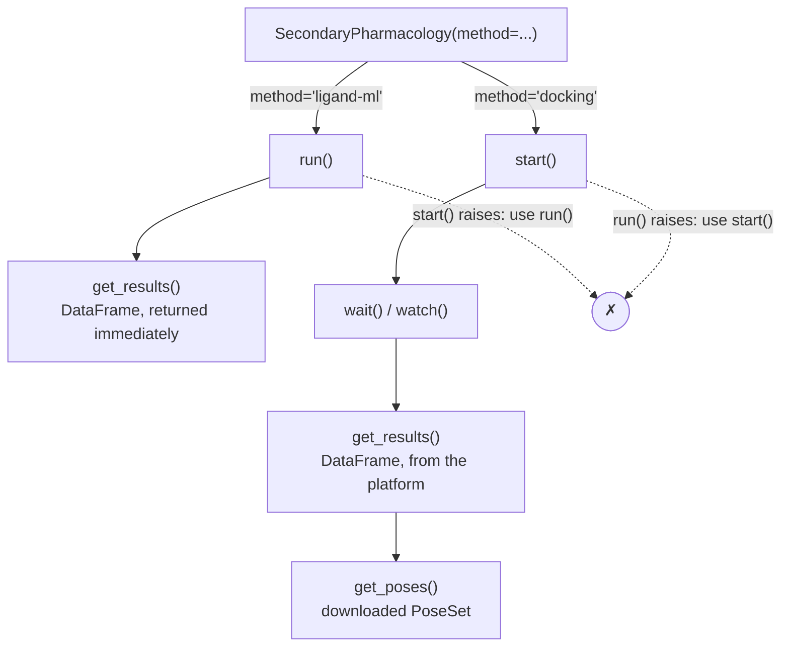

# Secondary Pharmacology

Score ligands against a baked secondary-pharmacology kinase panel (currently
EGFR, BRAF, and SRC — the panel is expected to grow) with
[`SecondaryPharmacology`](../ref/secondary_pharma.md).

## Two execution modes on one class

`SecondaryPharmacology` wraps two mutually-exclusive scoring paths, selected
by `method` at construction:

- `method="ligand-ml"` — served, synchronous XGBoost booster scoring. Use
  [`run()`](../ref/secondary_pharma.md).
- `method="docking"` (the default) — an async workflow. Use
  [`start()`](../ref/secondary_pharma.md).

`run()`, `start()`, and `watch()` are all available on every instance, but
only the one matching `method` works — the others raise immediately, telling
you which to call instead:



`get_results()` always returns a `pandas.DataFrame` regardless of method. On
the docking path, allow a moment after `wait()`/`watch()` completes — results
land in the platform's data index rather than the immediate response, the
same as [`Docking.get_results()`](../ref/docking.md).

## Ligand-ML scoring

```{.python notest}
from deeporigin.drug_discovery import SecondaryPharmacology, Ligand

ligand = Ligand.from_smiles("CCO")
job = SecondaryPharmacology(ligands=[ligand], method="ligand-ml")
df = job.run()
```

`df` has one row per ligand × panel member, with `uniprot_id`, `gene_name`,
and exactly one of `p_active` (classification) or `p_affinity` (regression,
-log10 M) set per row.

Restrict to a subset of the panel with `uniprots` (validated against the live
tool definition's panel enum at construction):

```{.python notest}
job = SecondaryPharmacology(
    ligands=[ligand],
    method="ligand-ml",
    uniprots=["P00533"],  # EGFR only
)
```

## Docking

```{.python notest}
job = SecondaryPharmacology(ligands=[ligand], method="docking", effort=2)
job.start()
job.wait()               # or `await job.watch()` in a notebook
df = job.get_results()
```

`df` has one row per docked pose, including `pose_score`, `binding_energy`,
and `file_path`. To load and download the poses as a
[`PoseSet`](../ref/pose.md) instead — for visualization, SDF export, or
feeding into a downstream tool like `ABFE`:

```{.python notest}
poses = job.get_poses()
```

`effort` (1–5) is validated on both methods before submission, even though
the tool only uses it for docking.

## Self-test

Both methods accept `self_test=True` (mutually exclusive with `ligands` —
passing both raises), which scores a baked test ligand (gefitinib) against
the full panel:

```{.python notest}
job = SecondaryPharmacology(self_test=True, method="ligand-ml")
df = job.run()
```

On the ligand-ml path, this exercises the real mounted model volume, not a
stub — useful as a quick end-to-end health check of the tool itself.

!!! warning "Self-test has no results on the docking path"
    The baked test ligand has no ligand id, so no panel poses are ever
    published for it. Both `get_results()` and `get_poses()` raise —
    use the ligand-ml path above for a self-test health check instead.

## Working with existing runs

```{.python notest}
job = SecondaryPharmacology.from_id("<executionId>")
job.sync()
df = job.get_results()
```

`from_dto`/`from_id` restore `method`, `ligands`, `uniprots`, `effort`, and
`self_test` from the stored execution inputs. A rehydrated instance's
`uniprots` is read-only until `duplicate()`, which re-fetches the live tool
definition.

## Current limitations

- The panel is small (3 kinases today) and only grows by tool version bump —
  `uniprots` validation is against whatever panel the pinned `tool_version`
  shipped with.
- The docking workflow has no ligand batching (unlike `deeporigin.docking`'s
  `batchSize`): it is a single Argo task with no fan-out, so a very large
  ligand list runs as one job against a fixed resource/time budget.
