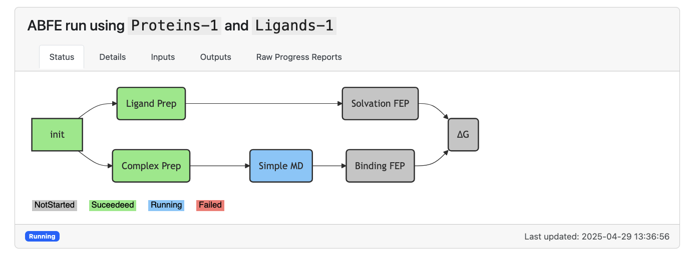
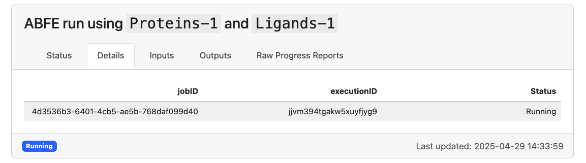

# ABFE

This document describes how to run a [ABFE :octicons-link-external-16:](https://en.wikipedia.org/wiki/Free-energy_perturbation) simulation using Deep Origin tools. 

## Prerequisites

We assume that we have an initialized and configured `Complex` object:

```python
from deeporigin.drug_discovery import Complex
sim = Complex.from_dir("/path/to/folder/")
sim.connect()
```

Here, ABFE requires that the `Complex` object have an already preppared protein (PDB), and the associated ligands (SDF) are in a docked pose.  

!!! WARNING
    The `Complex.from_dir()` function only accepts 1 PDB file per directory. This function will throw a warning if it finds more than 1 PDB file per directory. 

For more details on how to get started, see [:material-page-previous: Getting Started ](./getting-started.md).


## Starting an ABFE run


### Single ligand

To run an end-to-end ABFE workflow on a single ligand, we use:


```python
sim.abfe.run_end_to_end(ligand_ids=["Ligands-1"]) # for example
```

This queues up a task on Deep Origin. When it completes, outputs will be written to the appropriate column in this database. 


### Multiple ligands

To run an end-to-end ABFE workflow on multiple ligands, we use:

```python
sim.abfe.run_end_to_end(ligand_ids=["Ligands-1", "Ligands-2"]) 
```

Omitting the ligand IDs will run ABFE on all ligands in the `Complex` object.


```python
sim.abfe.run_end_to_end() 
```

Each ligand will be run in parallel on a separate instance. 


## Job Control 

Once a job has been submitted, you can track the its status using our built in job tracking:

```python

sim.abfe.show_jobs()

```


!!! success "Expected output" 
    

Here, the specific stage of the calculation is reported, with the most up-to-date logging information available in the `Raw Progress Reports` tab.


If we want to cancel a job, first gran the `jobID` from the `Details` tab of the Job Control panel:

!!! success "Expected output" 
    

In the above case, the `jobID` is `4d3536b3-6401-4cb5-ae5b-768daf099d40`. Next, we can cancel that job via:


```python
from deeporigin.tools import utils 

utils.cancel_runs(['4d3536b3-6401-4cb5-ae5b-768daf099d40'])
```

Note that this function accepts a list of `jobID`. 

## Parameters

### Viewing parameters

The end to end ABFE tool has a number of user-accessible parameters. To view all parameters, use:

```python
sim.abfe._params.end_to_end
```
??? success "Expected output" 
    This will print a dictionary of the parameters used for ABFE, similar to:

    ```json
    {
      "abfe": {
        "add_fep_repeats": 0,
        "amend": "__NO_AMEND",
        "annihilate": true,
        "atom_mapping_threshold": 0.01,
        "em_all": true,
        "em_solvent": true,
        "emeq_md_options": {
          "T": 298.15,
          "cutoff": 0.9,
          "fourier_spacing": 0.12,
          "hydrogen_mass": 2.0,
          "Δt": 0.004
        },
        "fep_windows": [
          {
            "restraints_A": [
              0.0,
              0.01,
              0.025,
              0.05,
              0.1,
              0.35,
              0.5,
              0.75,
              1.0
            ]
          },
          {
            "coul_A": [
              1.0,
              0.8,
              0.6,
              0.4,
              0.2,
              0.0
            ]
          },
          {
            "vdw_A": [
              1.0,
              0.9,
              0.8,
              0.7,
              0.6,
              0.5,
              0.4,
              0.3,
              0.2,
              0.1,
              0.0
            ]
          }
        ],
        "mbar": 1,
        "npt_reduce_restraints_ns": 2.0,
        "nvt_heating_ns": 1.0,
        "prod_md_options": {
          "T": 298.15,
          "barostat": "MonteCarloBarostat",
          "barostat_exchange_interval": 500,
          "cutoff": 0.9,
          "fourier_spacing": 0.12,
          "hydrogen_mass": 2.0,
          "integrator": "BAOABIntegrator",
          "Δt": 0.004
        },
        "repeats": 1,
        "run_name": "binding",
        "skip_emeq": "__NO",
        "softcore_alpha": 0.5,
        "steps": 1250000,
        "system": "complex",
        "test_run": 0,
        "thread_pinning": 0,
        "thread_pinning_offset": 0,
        "threads": 0,
        "workers": 0
      },
      "complex_prep": {
        "include_ligands": 1,
        "include_protein": 1,
        "sysprep_params": {
          "charge_method": "bcc",
          "do_loop_modelling": false,
          "force_field": "ff14SB",
          "is_lig_protonated": true,
          "is_protein_protonated": true,
          "keep_waters": true,
          "lig_force_field": "gaff2",
          "ligand_res_names": [
            "LIG"
          ],
          "padding": 1.0,
          "save_gmx_files": false
        },
        "test_run": 0,
        "thread_pinning": 0,
        "thread_pinning_offset": 0
      },
      "emeq": {
        "amend": "__NO_AMEND",
        "em_all": true,
        "em_solvent": true,
        "emeq_md_options": {
          "T": 298.15,
          "cutoff": 0.9,
          "fourier_spacing": 0.12,
          "hydrogen_mass": 2.0,
          "Δt": 0.004
        },
        "from_run": "__USE_SYSTEM",
        "npt_reduce_restraints_ns": 0.2,
        "nvt_heating_ns": 0.1,
        "test_run": 0,
        "thread_pinning": 0,
        "thread_pinning_offset": 0,
        "threads": 0
      },
      "ligand_prep": {
        "include_ligands": 1,
        "include_protein": 0,
        "sysprep_params": {
          "charge_method": "bcc",
          "do_loop_modelling": false,
          "force_field": "ff14SB",
          "is_lig_protonated": false,
          "is_protein_protonated": false,
          "keep_waters": false,
          "lig_force_field": "gaff2",
          "padding": 1.0,
          "save_gmx_files": false
        },
        "test_run": 0,
        "thread_pinning": 0,
        "thread_pinning_offset": 0
      },
      "md": {
        "amend": "__NO_AMEND",
        "continue": 0,
        "from_run": "__USE_SYSTEM",
        "md_options": {
          "T": 298.15,
          "barostat": "MonteCarloBarostat",
          "barostat_exchange_interval": 500,
          "cutoff": 0.9,
          "fourier_spacing": 0.12,
          "hydrogen_mass": 2.0,
          "integrator": "BAOABIntegrator",
          "Δt": 0.004
        },
        "run_name": "md",
        "steps": 250000,
        "test_run": 0,
        "thread_pinning": 0,
        "thread_pinning_offset": 0,
        "threads": 0
      },
      "solvation": {
        "add_fep_repeats": 0,
        "amend": "__NO_AMEND",
        "annihilate": true,
        "atom_mapping_threshold": 0.01,
        "em_all": true,
        "em_solvent": true,
        "emeq_md_options": {
          "T": 298.15,
          "cutoff": 0.9,
          "fourier_spacing": 0.12,
          "hydrogen_mass": 2.0,
          "Δt": 0.004
        },
        "fep_windows": [
          {
            "coul_A": [
              1.0,
              0.8,
              0.6,
              0.4,
              0.2,
              0.0
            ]
          },
          {
            "vdw_A": [
              1.0,
              0.9,
              0.8,
              0.7,
              0.6,
              0.5,
              0.4,
              0.3,
              0.2,
              0.1,
              0.0
            ]
          }
        ],
        "mbar": 1,
        "npt_reduce_restraints_ns": 0.2,
        "nvt_heating_ns": 0.1,
        "prod_md_options": {
          "T": 298.15,
          "barostat": "MonteCarloBarostat",
          "barostat_exchange_interval": 500,
          "cutoff": 0.9,
          "fourier_spacing": 0.12,
          "hydrogen_mass": 2.0,
          "integrator": "BAOABIntegrator",
          "Δt": 0.004
        },
        "repeats": 1,
        "skip_emeq": "__NO",
        "softcore_alpha": 0.5,
        "steps": 300000,
        "test_run": 1,
        "thread_pinning": 0,
        "thread_pinning_offset": 0,
        "threads": 0,
        "workers": 0
      }
    }

    ```

### Modifying parameters

Any of these parameters are modifiable using dot notation. For example, to change the number of steps in the MD step, we can use:

```python
sim.abfe._params.end_to_end.md.steps = 500000
```

### Using `test_run`

The test run parameter can be used to run ABFE for a short number of steps, to verify that all steps execute quickly. This should not be used to run production simulations.

To set the test run parameter to 1, we can use:


```python
from deeporigin.utils.core import set_key_to_value
set_key_to_value(sim.abfe._params.end_to_end, "test_run", 1)
```


## Results

### Viewing results

After initiating a run, we can view results using:

```python
sim.abfe.show_results()
```  

This shows a table similar to:

!!! success "Expected output" 
    


### Exporting results for analysis


These results can be exported for analysis using:

```python
df = sim.abfe.get_results()
df
```

!!! success "Expected output" 
    | Binding       | Solvation            | AnalyticalCorr | Std | Total         | ID         | File       | r_exp_dg | SMILES                                                                                                                                                                               |
    |---------------|----------------------|----------------|-----|---------------|------------|------------|----------|--------------------------------------------------------------------------------------------------------------------------------------------------------------------------------------|
    | 16.23   | -27.53 | -7.2 | 0.0 | -36.50 | Ligands-1  | brd-2.sdf  | -9.59    | [H]C1=C([H])C(C(=O)N(C([H])([H])[H])C([H])([H])[H])=C([H])C(C2=C([H])N(C([H])([H])[H])C(=O)C3=C2C([H])=C([H])N3[H])=C1[H]                                      |
    | -454.99 | -722.01       | -7.58   | 0.0 | -259.44 | Ligands-2  | brd-3.sdf  | -7.09    | [H]C([H])=C([H])C([H])([H])N1C(=O)C2=C(C([H])=C([H])N2[H])C(C2=C([H])C([H])=C([H])C(C(=O)N(C([H])([H])[H])C([H])([H])[H])=C2[H])=C1[H]                    |
    | -600.31 | -1354.79      | -7.47   | 0.0 | -747.00 | Ligands-3  | brd-4.sdf  | -8.64    | [H]C1=C([H])C(C(=O)N(C([H])([H])[H])C([H])([H])[H])=C([H])C(C2=C([H])N(C([H])([H])/C([H])=C(\[H])C([H])([H])[H])C(=O)C3=C2C([H])=C([H])N3[H])=C1[H]            |