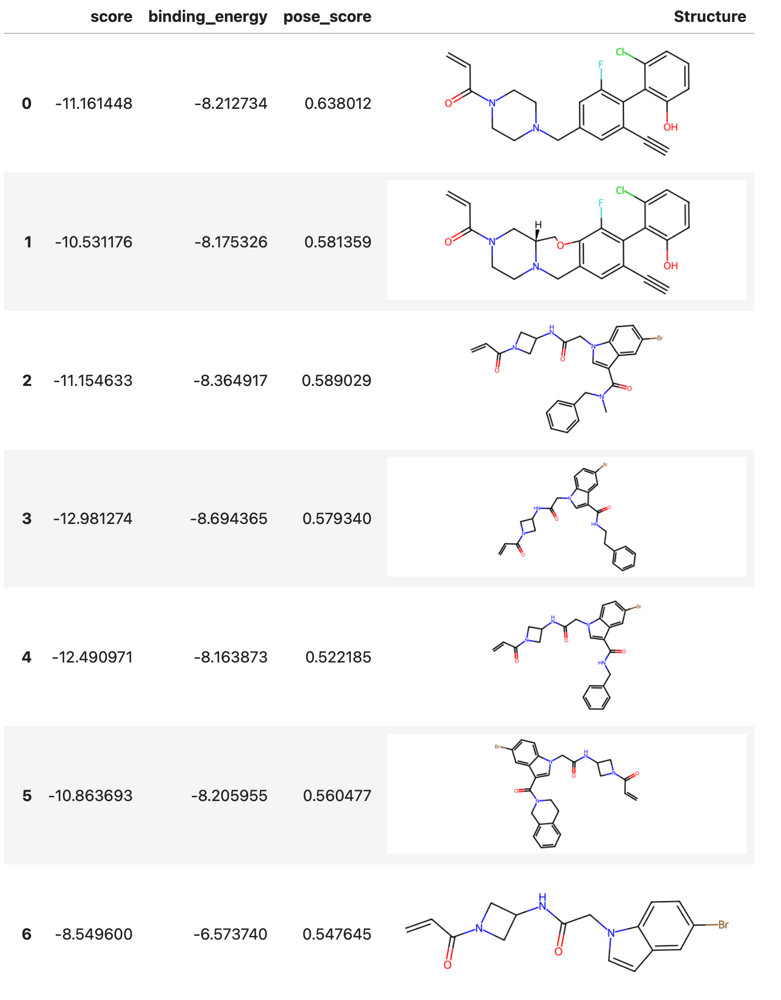

# Docking

This document describes how to [dock :octicons-link-external-16:](https://en.wikipedia.org/wiki/Docking_(molecular)) a set of ligands to a protein  using Deep Origin tools. 

## Prerequisites

We assume that we have an initialized and configured `Complex` object:

```python
from deeporigin.drug_discovery import Complex
sim = Complex.from_dir("/path/to/folder/")
sim.connect()
```

For more details on how to get started, see [:material-page-previous: Getting Started ](./getting-started.md).

## Starting a docking run

To dock all ligands to the protein, parallelizing and batching across all ligands, we do the following:


```python
sim.docking.run(
    box_size=(15, 15, 15),      # match to your protein
    pocket_center=(13, -6, 22), # match to your protein
)
```

??? info "Controlling batch size"

    By default, all ligands are docked in batches of 32 ligands. 

    This can be controlled in two ways. First, you can control the batch size using the `batch_size` parameter.

    ```python
    sim.dock(
        batch_size=32,
        box_size=(15, 15, 15),      # note: tuple  
        pocket_center=(13, -6, 22), # note: tuple  
    )
    ```

    You can also specify the number of workers using:

    ```python
    sim.dock(
        n_workers=2,
        box_size=(15, 15, 15),      # note: tuple  
        pocket_center=(13, -6, 22), # note: tuple  
    )
    ```

    You can specify either the number of workers or the batch size, but not both. 


This queues up tasks on Deep Origin. When it completes, the results of docking can be viewed.

## Viewing status of docking

The status of docking runs can be viewed using:

```python
sim.get_status_for("Docking")
```

!!! success "Expected output"

    A typical output can look like:


    ```python
    {'ccdb9ba9-b3d2-4083-bb4c-7c7249f7dbc2': 'Succeeded',
     '17a0b478-c11d-48a9-9bce-2e0272b804fb': 'Running',
     '08342c26-b773-4423-91c3-3fcbe4955778': 'Running'}
    ```

    The keys are IDs of the jobs running on Deep Origin. You may see different numbers of jobs based on your `batch_size` parameter and the number of ligands in your dataset.

## Results

### Viewing results

After completion of docking, we can view results using:

```python
sim.docking.show_results()
```  

This shows a table similar to:



### Viewing docked poses

To view the docked poses of all ligands in the complex, use:

```python
sim.docking.show_poses()
```

<iframe 
    src="./docked-poses.html" 
    width="100%" 
    height="650" 
    style="border:none;"
    title="Protein visualization"
></iframe>


### Exporting for further analysis

To obtain the raw dataframe for further analysis, use:

```python
df = sim.docking.get_results()
```