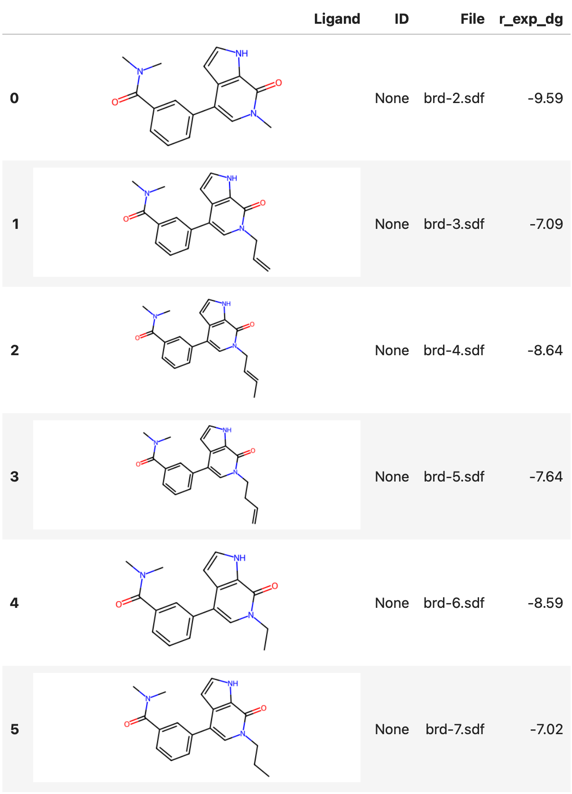
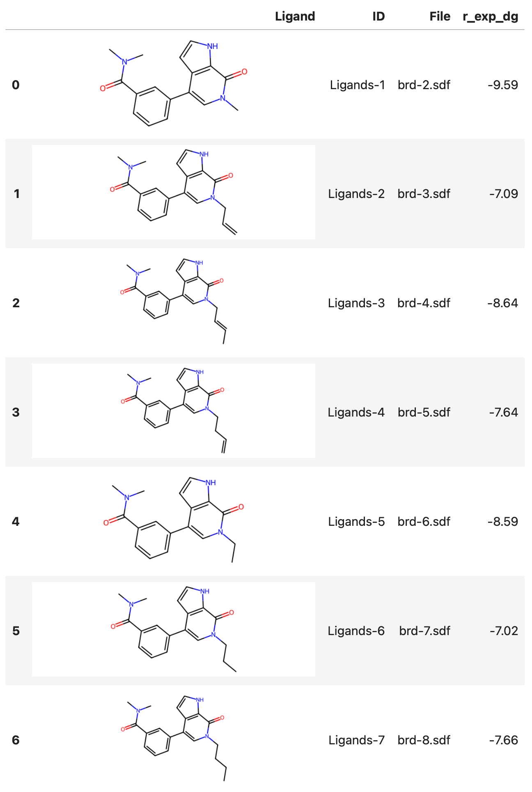

# Getting started with the Drug Discovery toolbox

This document describes how to use the Drug Discovery toolbox to perform docking and run ABFE and RBFE runs on Deep Origin. Functionality for this is built around the [:material-book:Complex](../ref/complex.md) class, that can be imported using:

```python
from deeporigin.drug_discovery import Complex
```

For the rest of this tutorial, we will assume that this module is imported as `dd`. 

## Prerequisites 

Make sure you have [:material-page-previous: installed](../../install.md), [:material-page-previous: configured](../../configure.md), and [:material-page-previous: authenticated](../../how-to/auth.md) with the Deep Origin python client.

!!! tip "Recommended installation method" 
    We recommend using [:material-page-previous: these instructions](../../install.md#recommended-installation) to install the Deep Origin python client.

    Following these instructions will install the deeporigin client in an isolated environment using `uv`, and will start a Jupyter instance that you will need for the rest of this tutorial.


## Input data

Docking, ABFE, and RBFE require a protein to be in a PDB file as input.

Ligands can be imported from SDF files or SMILES strings. To run ABFE and RBFE, the ligand must be in a SDF file.

!!! tip "Example data"
    If you want to explore these tools using some example data, we provide the BRD protein and a few ligands. This is built into the `deeporigin` package and can be accessed using:

    ```python
    from deeporigin.drug_discovery import EXAMPLE_DATA_DIR
    ```

## Creating a `Complex` object

The core of the Drug Discovery toolbox is the `Complex` class, that acts as a container for a protein and a set of ligand.

The `Complex` object can be created using:

```python
# here, we're using the example data directory
sim = Complex.from_dir(EXAMPLE_DATA_DIR)
```

Inspecting the object shows that it contains a protein and 8 ligands:

```python
sim
```


!!! success "Expected output"
    ```python
    Complex(protein=brd.pdb with 8 ligands)
    ```

### Listing Ligands

We can further inspect the ligands by inspecting the `ligands` attribute:

```python
sim.ligands
```

!!! success "Expected output"
    ```python
    [Ligand(
      file: '/Users/deeporigin/brd-2.sdf'
       smiles_string: '[H]C1=C([H])C(...'
       _do_id: 'Ligands-1'
       properties: {'r_exp_dg': '-9.59'}
    ),...]
    ```

!!! tip "Jupyter notebooks"
    It is assumed that you are working in a Jupyter notebook (or similar IPython environment). This makes it easier to run the workflow, and some functions assume that you are in a Jupyter notebook.


### Viewing Ligands (2D in table)

We can also view a table of 2D structures of the ligands, together with user-defined properties using the `show_ligands` method:

```python
sim.show_ligands()
```

!!! success "Expected output"
    


### Viewing Ligands (3D structures)

We can also view a table of 3D structures as follows:

```python
sim.show_ligands("3D")
```


<iframe 
    src="../how-to/brd-ligands.html" 
    width="100%" 
    height="650" 
    style="border:none;"
    title="Protein visualization"
></iframe>


## Initialization

Notice that the ID column in the Ligands table shows `None` for every ligand. This means that we haven't uploaded Ligand SDF files to Deep Origin yet. We can do using the `connect` method:

```python
sim.connect()
```

Using `sim.show_ligands()`, we see that the ID column is now assigned:

!!! success "Expected output"
    


That's it! We are now ready to perform [:material-page-next: docking](./docking.md), [:material-page-next: ABFE](./abfe.md), and [:material-page-next: RBFE](./rbfe.md).


