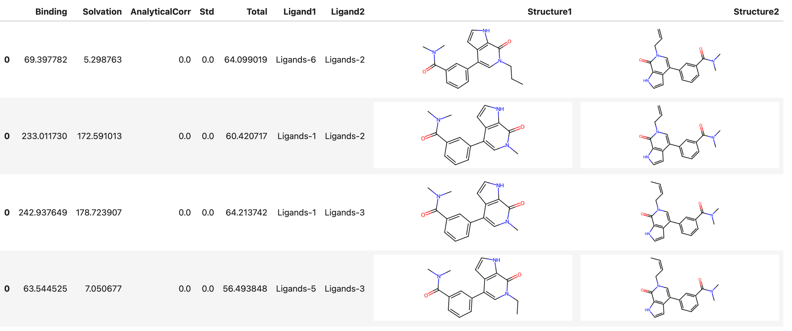

# RBFE

This document describes how to run a [RBFE :octicons-link-external-16:](https://en.wikipedia.org/wiki/Free-energy_perturbation) simulation using Deep Origin tools. 

## Prerequisites

We assume that we have an initialized and configured `Complex` object:

```python
from deeporigin.drug_discovery import Complex
sim = Complex.from_dir("/path/to/folder/")
sim.connect()
```
For more details on how to get started, see [:material-page-previous: Getting Started ](./getting-started.md).


## Starting an RBFE run


### Single pair of ligands

To run an end-to-end RBFE workflow on a single pair of ligands, we use:


```python
sim.rbfe.run_end_to_end(
    ligand1_id="Ligands-1",  # for example
    ligand2_id="Ligands-2",
)

```

This queues up a task on Deep Origin. When it completes, outputs will be written to the appropriate column in this database. 

You will see a message printed to screen similar to:


!!! success "Expected output" 
    ```bash
    🧬 Job started with ID: 20f05e96, execution ID: x9rl5eghrpqwyiciehc3e
    ```


### Constructing a network

!!! tip "Coming soon" 
    Ability to construct a network of ligands for RBFE is coming soon.


### Parameters


The end to end RBFE tool has a number of user-accessible parameters. To view all parameters, use:

```python
sim.rbfe._params.end_to_end
```
??? success "Expected output" 
    This will print a dictionary of the parameters used for RBFE, similar to:

    ```json
    {
        "complex_prep": {
            "include_ligands": 1,
            "include_protein": 1,
            "sysprep_params": {
                "charge_method": "bcc",
                "do_loop_modelling": false,
                "force_field": "ff14SB",
                "is_lig_protonated": false,
                "is_protein_protonated": false,
                "keep_waters": false,
                "lig_force_field": "gaff2",
                "padding": 1.0,
                "save_gmx_files": false
            },
            "test_run": 0,
            "thread_pinning": 1,
            "thread_pinning_offset": 0
        },
        "ligand1_prep": {
            "include_ligands": 1,
            "include_protein": 0,
            "sysprep_params": {
                "charge_method": "bcc",
                "do_loop_modelling": false,
                "force_field": "ff14SB",
                "is_lig_protonated": false,
                "is_protein_protonated": false,
                "keep_waters": false,
                "lig_force_field": "gaff2",
                "padding": 1.0,
                "save_gmx_files": false
            },
            "test_run": 0,
            "thread_pinning": 1,
            "thread_pinning_offset": 0
        },
        "ligand2_prep": {
            "include_ligands": 1,
            "include_protein": 0,
            "sysprep_params": {
                "charge_method": "bcc",
                "do_loop_modelling": false,
                "force_field": "ff14SB",
                "is_lig_protonated": false,
                "is_protein_protonated": false,
                "keep_waters": false,
                "lig_force_field": "gaff2",
                "padding": 1.0,
                "save_gmx_files": false
            },
            "test_run": 0,
            "thread_pinning": 1,
            "thread_pinning_offset": 0
        },
        "rbfe": {
            "add_fep_repeats": 0,
            "amend": "__NO_AMEND",
            "annihilate": true,
            "atom_mapping_threshold": 0.01,
            "em_all": true,
            "em_solvent": true,
            "emeq_md_options": {
                "T": 298.15,
                "cutoff": 0.9,
                "fourier_spacing": 0.12,
                "hydrogen_mass": 2.0,
                "Δt": 0.004
            },
            "fep_windows": [
                {
                    "restraints_A": [
                        0.0,
                        0.01,
                        0.025,
                        0.05,
                        0.1,
                        0.35,
                        0.5,
                        0.75,
                        1.0
                    ]
                },
                {
                    "coul_A": [
                        1.0,
                        0.8,
                        0.6,
                        0.4,
                        0.2,
                        0.0
                    ]
                },
                {
                    "vdw_A": [
                        1.0,
                        0.9,
                        0.8,
                        0.7,
                        0.6,
                        0.5,
                        0.4,
                        0.3,
                        0.2,
                        0.1,
                        0.0
                    ]
                }
            ],
            "mbar": 1,
            "npt_reduce_restraints_ns": 2.0,
            "nvt_heating_ns": 1.0,
            "prod_md_options": {
                "T": 298.15,
                "barostat": "MonteCarloBarostat",
                "barostat_exchange_interval": 500,
                "cutoff": 0.9,
                "fourier_spacing": 0.12,
                "hydrogen_mass": 2.0,
                "integrator": "BAOABIntegrator",
                "Δt": 0.004
            },
            "repeats": 1,
            "run_name": "binding",
            "skip_emeq": "__NO",
            "softcore_alpha": 0.5,
            "steps": 1250000,
            "system": "complex",
            "test_run": 0,
            "thread_pinning": 1,
            "thread_pinning_offset": 0,
            "threads": 0,
            "workers": 0
        },
        "solvation1": {
            "add_fep_repeats": 0,
            "amend": "__NO_AMEND",
            "annihilate": true,
            "atom_mapping_threshold": 0.01,
            "em_all": true,
            "em_solvent": true,
            "emeq_md_options": {
                "T": 298.15,
                "cutoff": 0.9,
                "fourier_spacing": 0.12,
                "hydrogen_mass": 2.0,
                "Δt": 0.004
            },
            "fep_windows": [
                {
                    "coul_A": [
                        1.0,
                        0.8,
                        0.6,
                        0.4,
                        0.2,
                        0.0
                    ]
                },
                {
                    "vdw_A": [
                        1.0,
                        0.9,
                        0.8,
                        0.7,
                        0.6,
                        0.5,
                        0.4,
                        0.3,
                        0.2,
                        0.1,
                        0.0
                    ]
                }
            ],
            "mbar": 1,
            "npt_reduce_restraints_ns": 0.2,
            "nvt_heating_ns": 0.1,
            "prod_md_options": {
                "T": 298.15,
                "barostat": "MonteCarloBarostat",
                "barostat_exchange_interval": 500,
                "cutoff": 0.9,
                "fourier_spacing": 0.12,
                "hydrogen_mass": 2.0,
                "integrator": "BAOABIntegrator",
                "Δt": 0.004
            },
            "repeats": 1,
            "skip_emeq": "__NO",
            "softcore_alpha": 0.5,
            "steps": 300000,
            "test_run": 0,
            "thread_pinning": 1,
            "thread_pinning_offset": 0,
            "threads": 0,
            "workers": 0
        },
        "solvation2": {
            "add_fep_repeats": 0,
            "amend": "__NO_AMEND",
            "annihilate": true,
            "atom_mapping_threshold": 0.01,
            "em_all": true,
            "em_solvent": true,
            "emeq_md_options": {
                "T": 298.15,
                "cutoff": 0.9,
                "fourier_spacing": 0.12,
                "hydrogen_mass": 2.0,
                "Δt": 0.004
            },
            "fep_windows": [
                {
                    "coul_A": [
                        1.0,
                        0.8,
                        0.6,
                        0.4,
                        0.2,
                        0.0
                    ]
                },
                {
                    "vdw_A": [
                        1.0,
                        0.9,
                        0.8,
                        0.7,
                        0.6,
                        0.5,
                        0.4,
                        0.3,
                        0.2,
                        0.1,
                        0.0
                    ]
                }
            ],
            "mbar": 1,
            "npt_reduce_restraints_ns": 0.2,
            "nvt_heating_ns": 0.1,
            "prod_md_options": {
                "T": 298.15,
                "barostat": "MonteCarloBarostat",
                "barostat_exchange_interval": 500,
                "cutoff": 0.9,
                "fourier_spacing": 0.12,
                "hydrogen_mass": 2.0,
                "integrator": "BAOABIntegrator",
                "Δt": 0.004
            },
            "repeats": 1,
            "skip_emeq": "__NO",
            "softcore_alpha": 0.5,
            "steps": 300000,
            "test_run": 0,
            "thread_pinning": 1,
            "thread_pinning_offset": 0,
            "threads": 0,
            "workers": 0
        }
    }

    ```
Any of these parameters are modifiable using dot notation. For example, to change the number of steps in the RBFE step, we can use:

```python
sim.rbfe._params.end_to_end.rbfe.steps = 500000
```


## Results

### Viewing results

After initiating a run, we can view results using:

```python
sim.rbfe.show_results()
```  

This shows a table similar to:

!!! success "Expected output" 
    


### Exporting results for analysis


These results can be exported for analysis using:

```python
df = sim.rbfe.get_results()
df
```

!!! success "Expected output" 
    | Index | Binding    | Solvation          | AnalyticalCorr | Std | Total      | Ligand1   | Ligand2   | SMILES1                                                                                                                         | SMILES2                                                                                                                         |
    |-------|------------|--------------------|----------------|-----|------------|-----------|-----------|---------------------------------------------------------------------------------------------------------------------------------|---------------------------------------------------------------------------------------------------------------------------------|
    | 0     | 69.397782  | 5.298763           | 0.0            | 0.0 | 64.099019  | Ligands-6 | Ligands-2 | [H]C1=C([H])C(C(=O)N(C([H])([H])[H])C([H])([H]...                                                                             | [H]C([H])=C([H])C([H])([H])N1C(=O)C2=C(C([H])=...                                                                              |
    | 0     | 233.01173  | 172.591013         | 0.0            | 0.0 | 60.420717  | Ligands-1 | Ligands-2 | [H]C1=C([H])C(C(=O)N(C([H])([H])[H])C([H])([H]...                                                                             | [H]C([H])=C([H])C([H])([H])N1C(=O)C2=C(C([H])=...                                                                              |
    | 0     | 242.937649 | 178.723907         | 0.0            | 0.0 | 64.213742  | Ligands-1 | Ligands-3 | [H]C1=C([H])C(C(=O)N(C([H])([H])[H])C([H])([H]...                                                                             | [H]C1=C([H])C(C(=O)N(C([H])([H])[H])C([H])([H]...                                                                              |
    | 0     | 63.544525  | 7.050677           | 0.0            | 0.0 | 56.493848  | Ligands-5 | Ligands-3 | [H]C1=C([H])C(C(=O)N(C([H])([H])[H])C([H])([H]...                                                                             | [H]C1=C([H])C(C(=O)N(C([H])([H])[H])C([H])([H]...                                                                              |