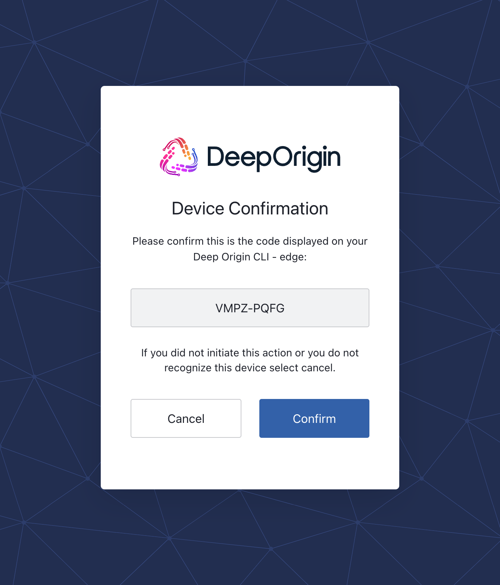
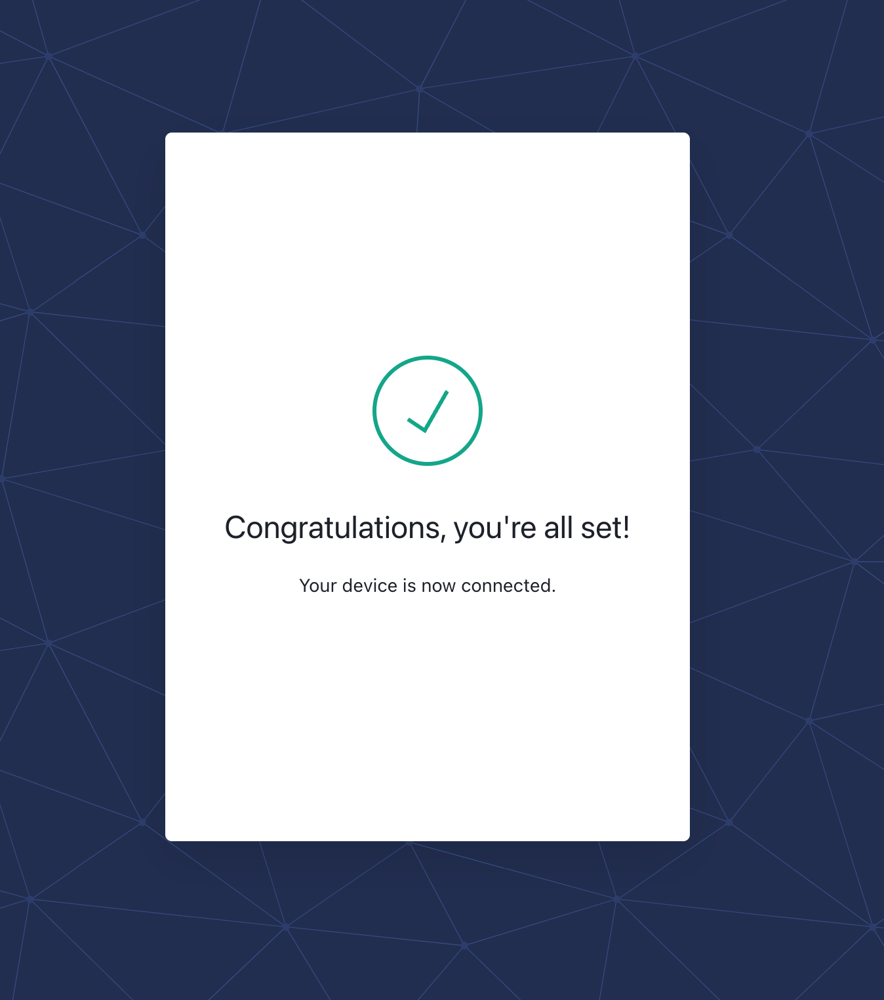

# Sign into Deep Origin

To use most of the functionality of the CLI or Python client, you must first run one of the following commands to sign into Deep Origin.

=== "CLI"

    ```bash
    deeporigin authenticate
    ```

=== "Python"

    ```python
    from deeporigin import auth
    auth.authenticate()
    ```

In either case, you will be presented with a prompt similar to below:

```
To connect to the Deep Origin platform, navigate your browser to 

https://<env>auth0.com/activate?user_code=VMPZ-PQFG

and verify the confirmation code is "VMPZ-PQFG", and click the "Confirm" button.

```

When you visit that URL, you will see a prompt that looks like:



After clicking the `Confirm` button, you will see a confirmation similar to below:



After signing in, your access tokens will be cached to disk and then automatically
be used in subsequent interactions with Deep Origin.

!!! info "Authenticating"
    In most cases, you only need to authenticate to the Deep Origin platform once.
    You do not need to authenticate every time you use the client or the CLI.
