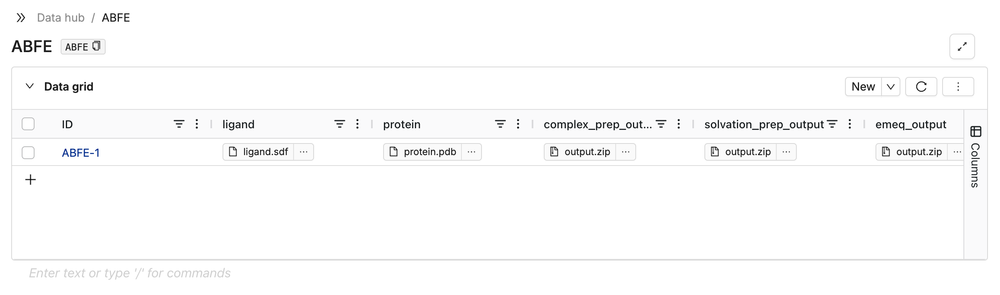
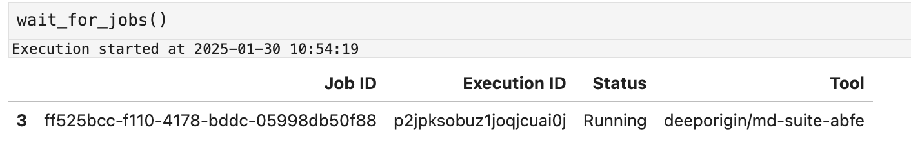

# ABFE

This document describes how to run a ABFE simulation using Deep Origin tools. 

## Prerequisites 

Make sure you have [installed](../../install.md), [configured](../../configure.md), and [authenticated](../../how-to/auth.md) with the Deep Origin python client. 

## Background

The following flowchart describes the workflow of ABFE that we will go through. Square boxes represent tools in the workflow, and rounded rectangles represent artifacts and files. 


## Required input files 

You will need to have the following input files on your local computer:

1. A ligand file, in SDF format
2. A protein PDF file 


## Running ABFE workflow

!!! tip "Jupyter notebooks"
    It is assumed that you are working in a Jupyter notebook (or similar IPython environment). This makes it easier to run the workflow, and some functions, such as `wait_for_jobs` assume that you are in a Jupyter notebook.

First, we import necessary functions and modules from the `deeporigin` package:

```python
from deeporigin.tools.utils import wait_for_jobs
from deeporigin.tools import abfe
```

We then specify where our input files are:

```python
protein_file = "/path/to/protein.pdb"
ligand_file = "/path/to/ligand.sdf"
```

### Initialization

Here, we data structures to store input and intermediate files, and upload input files to Deep Origin:

```python
row_id = abfe.init(
    ligand_file=ligand_file,
    protein_file=protein_file,
)
```

You will see a message similar to:

```bash
Using database at: https://os.deeporigin.io/org/org/data/database/ABFE
🧬 Uploading files to database...
🧬 Files uploaded to row ABFE-1.
```

This function creates a database for you on the DataHub, generates necessary columns, and uploads your input ligand and protein files to the appropriate columns in that database. 

The created database will look something like this:



!!! info "Row IDs"
    The `row_id` identifies a row in this database, and is used by all subsequent functions. You will always need to specify the row_id to each function. 


### Complex Prep

To run complex prep on the ligand and protein file, we use:

```python
abfe.complex_prep(
    row_id=row_id,
    is_lig_protonated=True,
)
```

This queues up a task on Deep Origin. When it completes, outputs will be written to the appropriate column in this database. 

You will see a message printed to screen similar to:


```bash
Using row ABFE-1 in database
🧬 Job started with ID: 20f05e96, execution ID: x9rl5eghrpqwyiciehc3e
```

??? Parameters for Complex Prep
    This function exposes a number of parameters. To see which parameters are available, and to modify them, look at the [reference documentation](../ref/abfe.md#src.tools.abfe.complex_prep)


### Solvation Prep

We do not have to wait for the complex prep step to complete in order to start this step. So we can start this step using: 

```python
abfe.solvation_prep(row_id=row_id)
```

This queues up a task on Deep Origin. When it completes, outputs will be written to the appropriate column in this database. 

You will see a message printed to screen similar to:


```bash
Using row ABFE-1 in database
🧬 Job started with ID: 20f05e96, execution ID: x9rl5eghrpqwyiciehc3e
```

??? Parameters for Solvation Prep
    This function exposes a number of parameters. To see which parameters are available, and to modify them, look at the [reference documentation](../ref/abfe.md#src.tools.abfe.solvation_prep)

!!! Tip "Waiting for Jobs"
    At this stage, we need to wait for these steps to complete to before proceeding to the next step. For example, we need to wait for the Complex Prep step to complete in order to proceed to the EMEQ step.

    To do this, use the `wait_for_jobs` function. The `wait_for_jobs` repeatedly polls Deep Origin to determine the status of jobs, and terminates when all jobs have completed. 

    While it is running (and blocking execution), you will see a table similar to this:

    

### EMEQ

To run EMEQ, we use:

```python
abfe.emeq(row_id=row_id)
```

This queues up a task on Deep Origin. When it completes, outputs will be written to the appropriate column in this database. 

You will see a message printed to screen similar to:


```bash
Using row ABFE-1 in database
🧬 Job started with ID: 20f05e96, execution ID: x9rl5eghrpqwyiciehc3e
```

??? Parameters for EMEQ
    This function exposes a number of parameters. To see which parameters are available, and to modify them, look at the [reference documentation](../ref/abfe.md#src.tools.abfe.emeq)

### Simple MD

To run simple MD, we use:

```python
abfe.simple_md(
    row_id=row_id,
    steps=1000,
)
```

This queues up a task on Deep Origin. When it completes, outputs will be written to the appropriate column in this database. 

You will see a message printed to screen similar to:


```bash
Using row ABFE-1 in database
🧬 Job started with ID: 20f05e96, execution ID: x9rl5eghrpqwyiciehc3e
```

??? Parameters for Simple MD
    This function exposes a number of parameters. To see which parameters are available, and to modify them, look at the [reference documentation](../ref/abfe.md#src.tools.abfe.simple_md)

### Binding FEP 

To run Binding FEP, we use:

```python
abfe.binding_fep(
    row_id,
    steps=1000,
)
```

This queues up a task on Deep Origin. When it completes, outputs will be written to the appropriate column in this database. 

You will see a message printed to screen similar to:


```bash
Using row ABFE-1 in database
🧬 Job started with ID: 20f05e96, execution ID: x9rl5eghrpqwyiciehc3e
```

??? Parameters for Binding FEP
    This function exposes a number of parameters. To see which parameters are available, and to modify them, look at the [reference documentation](../ref/abfe.md#src.tools.abfe.binding_fep)

### Solvation FEP


To run Solvation FEP, we use:

```python
abfe.solvation_fep(
    row_id=row_id,
    annihilate=True,
)
```

This queues up a task on Deep Origin. When it completes, outputs will be written to the appropriate column in this database. 

You will see a message printed to screen similar to:


```bash
Using row ABFE-1 in database
🧬 Job started with ID: 20f05e96, execution ID: x9rl5eghrpqwyiciehc3e
```

??? Parameters for Solvation FEP
    This function exposes a number of parameters. To see which parameters are available, and to modify them, look at the [reference documentation](../ref/abfe.md#src.tools.abfe.solvation_fep)


## Inspecting outputs

The output of any step can be inspected by downloading the linked zip file in the appropriate column in the database.