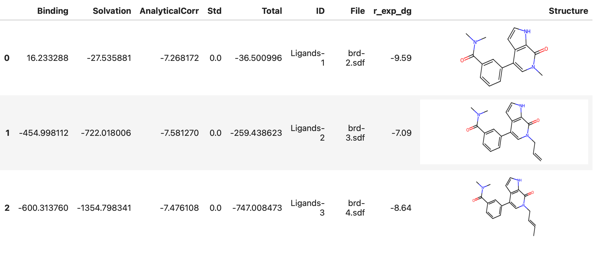

# ABFE

This document describes how to run a [ABFE](https://en.wikipedia.org/wiki/Free-energy_perturbation) simulation using Deep Origin tools. 

## Prerequisites 

Make sure you have [installed](../../install.md), [configured](../../configure.md), and [authenticated](../../how-to/auth.md) with the Deep Origin python client.

!!! tip "Use uv to install `deeporigin`" 
    We strongly recommend using [uv](https://docs.astral.sh/uv/) to install Deep Origin in a separate project, following instructions [here](../../install.md#using-uv-to-set-up-deeporigin-on-your-computer). This gives you all the dependencies you need, together with a stand-alone install of Jupyter Lab that you can use with `deeporigin`

## Background

The following flowchart describes the workflow of ABFE that we will go through. Square boxes represent tools in the workflow, and rounded rectangles represent artifacts and files. 


## Required input files 

You will need to have the following input files on your local computer:

1. A set of ligand files, in SDF format. Each SDF file should contain a single molecule. 
2. A protein PDF file 


## Running ABFE workflow

!!! tip "Jupyter notebooks"
    It is assumed that you are working in a Jupyter notebook (or similar IPython environment). This makes it easier to run the workflow, and some functions assume that you are in a Jupyter notebook.

First, we import necessary functions and modules from the `deeporigin` package:

```python
from deeporigin.tools import fep
```

We then specify where our input files are:

```python
input_dir = "/path/to/input/dir"
```

### Initialization

Here, we data structures to store input and intermediate files, and upload input files to Deep Origin:

```python
sim = fep.FEP.from_dir(input_dir)
```

!!! tip "Creating a FEP instance from specific files"
    You can instantiate the class directly from specific files if you don't want to use the `from_dir` function.

    ```python
    ligand = fep.Ligand(file="/path/to/ligand.sdf")
    protein = fep.Protein(file="/path/to/protein.pdb")

    sim = fep.FEP(ligands=[ligand], protein=protein)

    ```

Now, we can view the ligands that are part of this simulation:

```python
sim.show_ligands()
```

This will show a table similar to this:


### Connecting to Deep Origin

We can connect the instance we created to Deep Origin using

```python
sim.connect()
```


This function creates necessary databases on Deep Origin, uploads ligand and protein files if needed, and updates the status of runs on Deep Origin.


After connecting, running `show_ligands` again shows us that our ligands have been assigned IDs that we can use to refer to them in future operations:

```python
sim.show_ligands()
```


### Running end to end ABFE on a single ligand

To run an end-to-end ABFE workflow on a single ligand, we use:


```python
sim.abfe_end_to_end(ligand_ids=["Ligands-1"]) # for example
```

This queues up a task on Deep Origin. When it completes, outputs will be written to the appropriate column in this database. 

You will see a message printed to screen similar to:


```bash
🧬 Job started with ID: 20f05e96, execution ID: x9rl5eghrpqwyiciehc3e
```

??? Parameters for ABFE
    The end to end ABFE tool has a number of user-controllable parameters. To view all parameters, use:

    ```python
    sim.params_abfe_end_to_end
    ```

    This will print a dictionary of the parameters used for ABFE, similar to:

    ```json
    {
      "abfe": {
        "add_fep_repeats": 0,
        "amend": "__NO_AMEND",
        "annihilate": true,
        "atom_mapping_threshold": 0.01,
        "em_all": true,
        "em_solvent": true,
        "emeq_md_options": {
          "T": 298.15,
          "cutoff": 0.9,
          "fourier_spacing": 0.12,
          "hydrogen_mass": 2.0,
          "Δt": 0.004
        },
        "fep_windows": [
          {
            "restraints_A": [
              0.0,
              0.01,
              0.025,
              0.05,
              0.1,
              0.35,
              0.5,
              0.75,
              1.0
            ]
          },
          {
            "coul_A": [
              1.0,
              0.8,
              0.6,
              0.4,
              0.2,
              0.0
            ]
          },
          {
            "vdw_A": [
              1.0,
              0.9,
              0.8,
              0.7,
              0.6,
              0.5,
              0.4,
              0.3,
              0.2,
              0.1,
              0.0
            ]
          }
        ],
        "mbar": 1,
        "npt_reduce_restraints_ns": 2.0,
        "nvt_heating_ns": 1.0,
        "prod_md_options": {
          "T": 298.15,
          "barostat": "MonteCarloBarostat",
          "barostat_exchange_interval": 500,
          "cutoff": 0.9,
          "fourier_spacing": 0.12,
          "hydrogen_mass": 2.0,
          "integrator": "BAOABIntegrator",
          "Δt": 0.004
        },
        "repeats": 1,
        "run_name": "binding",
        "skip_emeq": "__NO",
        "softcore_alpha": 0.5,
        "steps": 1250000,
        "system": "complex",
        "test_run": 0,
        "thread_pinning": 0,
        "thread_pinning_offset": 0,
        "threads": 0,
        "workers": 0
      },
      "complex_prep": {
        "include_ligands": 1,
        "include_protein": 1,
        "sysprep_params": {
          "charge_method": "bcc",
          "do_loop_modelling": false,
          "force_field": "ff14SB",
          "is_lig_protonated": true,
          "is_protein_protonated": true,
          "keep_waters": true,
          "lig_force_field": "gaff2",
          "ligand_res_names": [
            "LIG"
          ],
          "padding": 1.0,
          "save_gmx_files": false
        },
        "test_run": 0,
        "thread_pinning": 0,
        "thread_pinning_offset": 0
      },
      "emeq": {
        "amend": "__NO_AMEND",
        "em_all": true,
        "em_solvent": true,
        "emeq_md_options": {
          "T": 298.15,
          "cutoff": 0.9,
          "fourier_spacing": 0.12,
          "hydrogen_mass": 2.0,
          "Δt": 0.004
        },
        "from_run": "__USE_SYSTEM",
        "npt_reduce_restraints_ns": 0.2,
        "nvt_heating_ns": 0.1,
        "test_run": 0,
        "thread_pinning": 0,
        "thread_pinning_offset": 0,
        "threads": 0
      },
      "ligand_prep": {
        "include_ligands": 1,
        "include_protein": 0,
        "sysprep_params": {
          "charge_method": "bcc",
          "do_loop_modelling": false,
          "force_field": "ff14SB",
          "is_lig_protonated": false,
          "is_protein_protonated": false,
          "keep_waters": false,
          "lig_force_field": "gaff2",
          "padding": 1.0,
          "save_gmx_files": false
        },
        "test_run": 0,
        "thread_pinning": 0,
        "thread_pinning_offset": 0
      },
      "md": {
        "amend": "__NO_AMEND",
        "continue": 0,
        "from_run": "__USE_SYSTEM",
        "md_options": {
          "T": 298.15,
          "barostat": "MonteCarloBarostat",
          "barostat_exchange_interval": 500,
          "cutoff": 0.9,
          "fourier_spacing": 0.12,
          "hydrogen_mass": 2.0,
          "integrator": "BAOABIntegrator",
          "Δt": 0.004
        },
        "run_name": "md",
        "steps": 250000,
        "test_run": 0,
        "thread_pinning": 0,
        "thread_pinning_offset": 0,
        "threads": 0
      },
      "solvation": {
        "add_fep_repeats": 0,
        "amend": "__NO_AMEND",
        "annihilate": true,
        "atom_mapping_threshold": 0.01,
        "em_all": true,
        "em_solvent": true,
        "emeq_md_options": {
          "T": 298.15,
          "cutoff": 0.9,
          "fourier_spacing": 0.12,
          "hydrogen_mass": 2.0,
          "Δt": 0.004
        },
        "fep_windows": [
          {
            "coul_A": [
              1.0,
              0.8,
              0.6,
              0.4,
              0.2,
              0.0
            ]
          },
          {
            "vdw_A": [
              1.0,
              0.9,
              0.8,
              0.7,
              0.6,
              0.5,
              0.4,
              0.3,
              0.2,
              0.1,
              0.0
            ]
          }
        ],
        "mbar": 1,
        "npt_reduce_restraints_ns": 0.2,
        "nvt_heating_ns": 0.1,
        "prod_md_options": {
          "T": 298.15,
          "barostat": "MonteCarloBarostat",
          "barostat_exchange_interval": 500,
          "cutoff": 0.9,
          "fourier_spacing": 0.12,
          "hydrogen_mass": 2.0,
          "integrator": "BAOABIntegrator",
          "Δt": 0.004
        },
        "repeats": 1,
        "skip_emeq": "__NO",
        "softcore_alpha": 0.5,
        "steps": 300000,
        "test_run": 1,
        "thread_pinning": 0,
        "thread_pinning_offset": 0,
        "threads": 0,
        "workers": 0
      }
    }

    ```
    Any of these parameters are modifiable using dot notation. For example, to change the number of steps in the MD step, we can use:

    ```python
    sim.params_abfe_end_to_end.md.steps = 500000
    ```


### Results

After initiating a run, we can view results using:

```python
abfe.show_abfe_results()
```  

This shows a table similar to:



If some jobs are running, they are listed in the table, as shown below:

