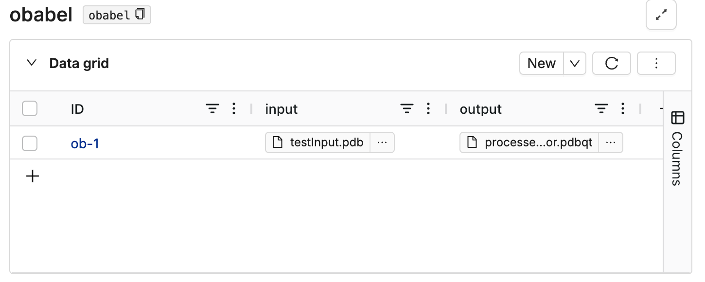

# PDB to PDBQT converter (Open Babel)

[Open Babel](https://open-babel.readthedocs.io/en/latest/UseTheLibrary/Python.html) is an open-source, cross-platform software library and toolkit designed for cheminformatics and molecular modeling. It is widely used in the fields of computational chemistry, bioinformatics, and molecular biology to work with chemical and molecular data. Open Babel supports a broad range of file formats and provides tools for tasks such as file conversion, molecular manipulation, and property calculation.

## Inputs

### Input file

A PDB file that needs to be converted to a PDBQT file.


## Running on Deep Origin

To run this tool on Deep Origin, follow these steps:

### 1. Create a database to store input and output files

Navigate to DataHub on Deep Origin, and create a database for this tool. Add columns for input and output files. Create a new row and upload your input files to the input column. 

This image shows an example database:



### 2. Start a tool run on Deep Origin

For this tool run, we will use the following parameters:


To start a tool run, use:

```python
from deeporigin.tools import run

job_id = run.pdb_pdbqt_converter(
    database_id="<your-db-name>",
    row_id="<row-name>",
    output_column_name="<output-column-name>",
    input_column_name="<receptor-column-name>",
)
```

`run.pdb_pdbqt_converter` returns the ID of the tool run, that can be used to monitor the status of the run and terminate it if needed. 

`run.pdb_pdbqt_converter` prints a message that looks like:

```bash
🧬 Job started with ID: 9f7a3741-e392-45fb-a349-804b7fca07d7
```


## Outputs 

### Output file

A PDBQT file converted from the input PDB file. 
