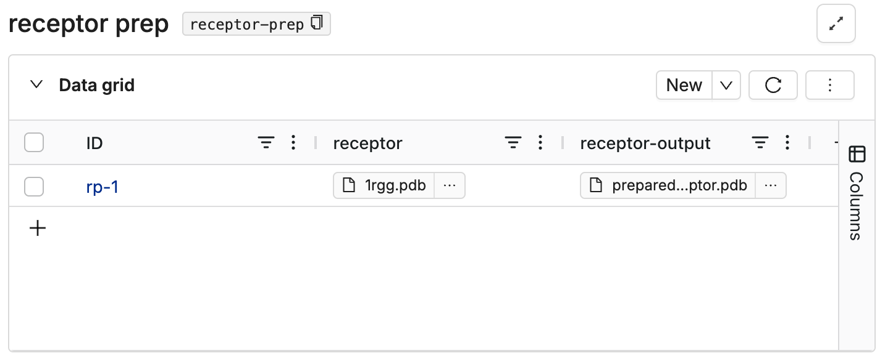

# Receptor Prep (PDBFixer)

[OpenMM](https://github.com/openmm)'s [PDBFixer](https://github.com/openmm/pdbfixer) is a Python library for preparing molecular structures for simulations, particularly when working with files in the [Protein Data Bank](https://www.cgl.ucsf.edu/chimera/docs/UsersGuide/tutorials/pdbintro.html) (PDB) format. It can address common issues such as missing heavy atoms, hydrogen atoms, or residues, and can add missing chains or fix terminal capping. It is often used in the preprocessing phase of molecular dynamics simulations.

## File Inputs:


### PDB File

A PDB file containing the structure of the molecule or system to be fixed.


## Parameters


### `addMissingResidues` 

| Type | Default |
| --- | --- |
| Bool | true |

Whether to add missing residues based on the structure and sequence.


### `addMissingAtoms`

| Type | Default |
| --- | --- |
| Bool | true |

### `addMissingHydrogens`

| Type | Default |
| --- | --- |
| Bool | true |

Whether to add hydrogen atoms to the structure, with optional control over pH for titration states.

### `pH` 

| Type | Default |
| --- | --- |
| Float | true |

### `removeHeterogens`

| Type | Default |
| --- | --- |
| Bool | true |

Whether to remove small molecules or ions from the structure, with options to retain water molecules.

### `removeWater`

| Type | Default |
| --- | --- |
| Bool | true |


## Running on Deep Origin

To run this tool on Deep Origin, follow these steps:

### 1. Create a database to store input and output files

Navigate to DataHub on Deep Origin, and create a database for this tool. Add columns for input and output files. Create a new row and upload your input files to the input column. 

This image shows an example database:



### 2. Start a tool run on Deep Origin

For this tool run, we will use the following parameters:


To start a tool run, use:

```python
from deeporigin.tools import run

job_id = run.receptor_prep(
    database_id="<your-db-name>",
    row_id="<row-name>",
    output_column_name="<output-column-name>",
    receptor_column_name="<receptor-column-name>",
    ligand_column_name="<ligand-column-name>",
    add_missing_residues=True,
    add_missing_atoms= True,
    add_missing_hydrogens= True,
    ph = 7.4,
    remove_heterogens= True,
    remove_water= True,
)
```

`run.receptor_prep` returns the ID of the tool run, that can be used to monitor the status of the run and terminate it if needed. 

`run.receptor_prep` prints a message that looks like:

```bash
🧬 Job started with ID: 9f7a3741-e392-45fb-a349-804b7fca07d7
```


## File Outputs:

### Fixed PDB File

The corrected and prepared molecular structure, which can be saved as a PDB file.